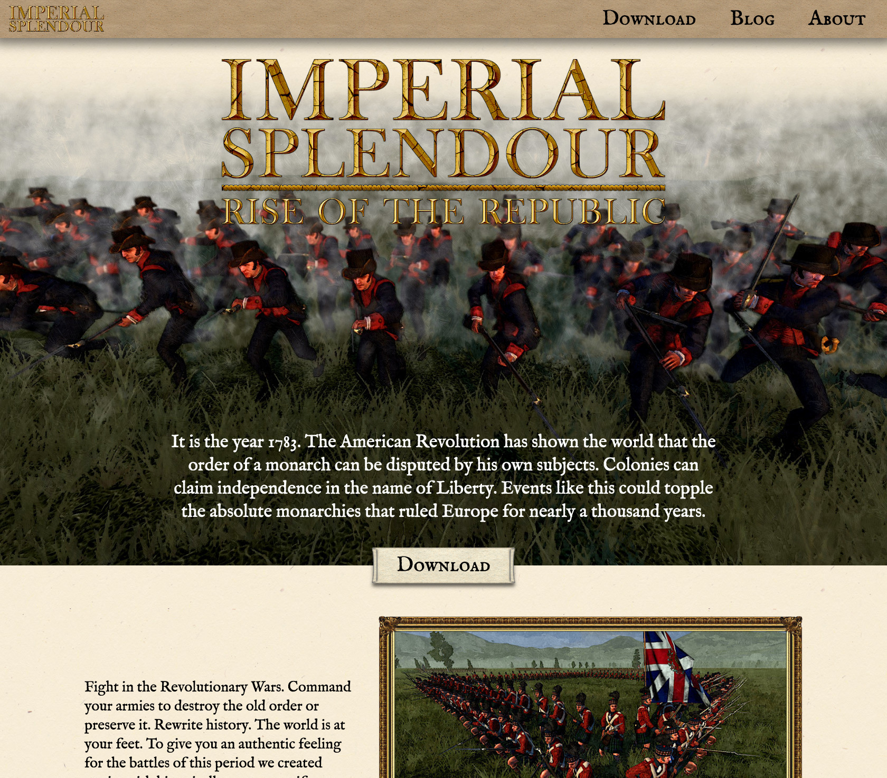

# Imperial Splendour Website



Fan site for the [Imperial Splendour](https://www.moddb.com/mods/imperial-splendour) Total War mod. Built with Astro + Svelte, deployed on Netlify.

[Setup](#setup) | [Commands](#commands) | [Troubleshooting](#troubleshooting) | [Meta](#meta) | [Credits](#credits)

## Setup

**Prerequisites:** Node.js v20+, npm

```sh
npm install
npm run dev     # http://localhost:4321
```

## Commands

| Command | Description |
|---|---|
| `npm run dev` | Start local dev server |
| `npm run build` | Build for production |
| `npm run preview` | Preview the production build locally |
| `npm run checks` | Run type checking |
| `npm run test-local` | Build + preview (full local test) |

## Troubleshooting

#### Questions, Bug Reports and Feature Requests
If you have questions, complaints, or suggestions feel free to let us know. There are multiple channel under which we are available:
* [this GitHub repo](https://github.com/SophieAu/imperial-splendour-site)
* [Facebook](https://www.facebook.com/imperialsplendour/)
* [Twitter](https://twitter.com/splendourteam)
* [Discord](https://discord.gg/Yx9cxf97)
* [the Total War forums](http://www.twcenter.net/forums/forumdisplay.php?1138-Imperial-Splendour)

## Meta
© [Sophie Au](https://sophieau.com) and [Malte Lippmann](https://github.com/QuintusHortensiusHortalus)

## Credits
The font used is [IM FELL English](https://fonts.google.com/specimen/IM+Fell+English).

The site is developed using [Astro](https://astro.build/) and [Svelte 5](https://svelte.dev/). It is hosted and deployed via [Netlify](https://netlify.com/). Content is managed through [Decap CMS](https://decapcms.org/) at `/admin`. The newsletter is managed through [Mailchimp](https://mailchimp.com/).

## Monthly Maintenance List

**Functionality:**

- [ ] Visit the site and click through all main pages - anything broken, missing, or visually off?
- [ ] Test on mobile - responsive layout can break silently after dependency updates
- [ ] Check for console errors in production (browser devtools)
- [ ] Check the newsletter signup form - does it actually submit and subscribe?

**Dependencies & Security:**

- [ ] Run `npm outdated` - review available updates
- [ ] Run `npm audit` - address any security advisories
- [ ] Update non-breaking deps (patch/minor)
- [ ] Update breaking deps in a separate commit/deploy

**Infrastructure:**

- [ ] Check Netlify dashboard - recent builds succeeding? Any errors or warnings?
- [ ] Verify Decap CMS is accessible at `/admin` and content can be edited and saved
- [ ] Check analytics for unexpected traffic drops or error spikes
