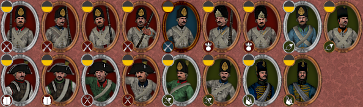

The pact with Russia strengthened Austria's position on the international plane as an alliance with Habsburg Austria has now become "the most desirable object" in the eyes of many monarchs and a potential object of bargain. Their impact on international politics is notable and an aggressive state like Austria will surely make it worthwhile. If the Habsburg Empire plays its cards right, it may see the beginning of a new era for the German Empire with Austria at its head.

Alliances with France and Russia disturb the courts of Europe as a new coalition of powers seems to be arising, a very dangerous one, all with imperialistic tendencies. The once-feared Ottoman Empire is now slowly degrading into a puppet of the West. Still, most Ottoman forces will be fixed on Austria so keeping your borders safe will require positioning all troops to prevent any unexpected attacks. Moldavia will be of great strategic importance in the upcoming wars as gaining Moldavia would give Austria direct access to the Black Sea. Do not be so gullible for Russia will not let you extend Habsburg power in the Balkans so easily, therefore, seeking new alliances, maybe outside of Europe, such as Persia would prove useful.

The unnatural Franco-Austrian alliance is maintained out of fear of Sardinia claiming French lands and Austria losing the Netherlands and other possessions in central Europe. The French will, for their own sake, take the role of peacekeeper of Europe, so have that in mind when you decide to wage war. France will likely stay neutral in a potential war against the Ottomans.

The Austrian Netherlands aren't of much use, their maintenance is costly and are difficult to administer, however, you could try trading them for something else, maybe switching them for Bavaria. Disputes with the Dutch Republic should not worry you, the republic is currently in turmoil and does not pose a significant threat. An alliance with them might help you stabilize the situation in your own region and help suffocate rebellious ideas coming from the Netherlands.

You have already made peace with Morocco, now it is only the remaining Barbary States who endanger Austrian shipping. Pesky Venetians continued to control the Adriatic with their fleet being one of the strongest in the Mediterranean so a potential Austrian navy would hardly stand a chance. Capturing Venice would not only connect Lombardy to the domains but would also help you increase your influence in Italy.

Three years have passed since the death of Empress Maria Theresa and Joseph's hands are now untied. What awaits Europe is yet to be seen. The possibilities are endless so choosing your strategy will have to be thoughtfully devised.

Here is the Austrian army:

