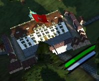

Here are some of my building and city models for RotR:

## Rathaus Coburg

<table>
<td>
<iframe width="640" height="480" src="https://sketchfab.com/models/b65305da47c947f2893b160f70d114ce/embed?preload=1&amp;ui_controls=1&amp;ui_infos=1&amp;ui_inspector=1&amp;ui_stop=1&amp;ui_watermark=1&amp;ui_watermark_link=1" frameborder="0" allow="autoplay; fullscreen; vr" mozallowfullscreen="true" webkitallowfullscreen="true"></iframe>

[Rathaus Coburg](https://sketchfab.com/3d-models/rathaus-coburg-b65305da47c947f2893b160f70d114ce?utm_medium=embed&utm_source=website&utm_campaign=share-popup) by [QuintusHortensiusHortalus](https://sketchfab.com/QuintusHortensiusHortalus) on [Sketchfab](https://sketchfab.com)

</td>

<td>

This is the in-game Empire Total War model: !\

</td>

</table>

This is the townhall of Coburg. The model is actually different from the townhall as it is today because some alteritions were done in the early 20th century. As I’m using this model in the 18th century mod Imperial Splendour I tried to represent the state of the townhall in that era. The mayor differences are that the ground floor still looked like several buildings in the 18th century because this is, what the townhall was. Several buildings were merged together to create the townhall. When this was done the ground floor was left as it was. The ground floor were only changed in the early 20th century and a balcony was added in the middle of the first floor.

## Altes Braunschweiger Schloss

<table>
<td>
<iframe width="640" height="480" src="https://sketchfab.com/models/9e23ff7bb7234c25920a5b1cd7e3a149/embed?preload=1&amp;ui_controls=1&amp;ui_infos=1&amp;ui_inspector=1&amp;ui_stop=1&amp;ui_watermark=1&amp;ui_watermark_link=1" frameborder="0" allow="autoplay; fullscreen; vr" mozallowfullscreen="true" webkitallowfullscreen="true"></iframe>

[Altes Braunschweiger Schloss](https://sketchfab.com/3d-models/altes-braunschweiger-schloss-9e23ff7bb7234c25920a5b1cd7e3a149) by [QuintusHortensiusHortalus](https://sketchfab.com/QuintusHortensiusHortalus) on [Sketchfab](https://sketchfab.com)

</td>

<td>

I made the building without any plans the only things I had were variants of an engraving (so the outer sides of the wings with their decorations were created by me) and for the colours wikipedia stated that the mid-wing was build in sandstone and I had this painting (almost identical perspective of the engravings) from the 1830 fire:  !\

This is the in-game Empire Total War model: !\

</td>

</table>

The "Altes Braunschweiger Schloss" (old Brunswick Palace) was the official residence of the Dukes of Brunswick-Wolfenbüttel.  The building of that palace lasted almost the entire 18th century. In the early 18th century the architect Hermann Korb was charged with developing plans for a palace in Brunswick. He chose to create a building with 3 wings in French Baroque style with the for Korb typical arcades. Building started in 1718.
The inner wings were the first parts to be completed in 1724. From the side wings, the outer northern side-wing was the last to be completed in 1754. But the central wing was at that time far from being done. Despite that the palace was made official residence in 1753 and the Dukes moved to the “Braunschweiger Schloss”. Finally, the central wing was completed from 1783 to 1791 in the Classical style.
Just 40 years later in 1830 the palace was burned down by Revolutionaries. After the fire another palace was built on the same spot.

## St James's Palace

<table>
<td>
<iframe width="640" height="480" src="https://sketchfab.com/models/9ebcaaca6ba8451eabd6344230272c0f/embed?preload=1&amp;ui_controls=1&amp;ui_infos=1&amp;ui_inspector=1&amp;ui_stop=1&amp;ui_watermark=1&amp;ui_watermark_link=1"
frameborder="0" allow="autoplay; fullscreen; vr" mozallowfullscreen="true" webkitallowfullscreen="true"></iframe>

[St James's Palace](https://sketchfab.com/3d-models/st-jamess-palace-9ebcaaca6ba8451eabd6344230272c0f) by [QuintusHortensiusHortalus](https://sketchfab.com/QuintusHortensiusHortalus) on [Sketchfab](https://sketchfab.com)

</td>

<td>

This is the in-game Empire Total War model: !\

</td>

</table>

This model represents St James’s Palace in the Empire Total War mod Imperial Splendour.

## Schloss Salzdahlum

<table>
<td>
<iframe width="640" height="480" src="https://sketchfab.com/models/9212073514a74215abe129e06be1bb83/embed" frameborder="0" allow="autoplay; fullscreen; vr" mozallowfullscreen="true" webkitallowfullscreen="true"></iframe>

[Schloss Salzdahlum](https://sketchfab.com/models/9212073514a74215abe129e06be1bb83) by [QuintusHortensiusHortalus](https://sketchfab.com/QuintusHortensiusHortalus) on [Sketchfab](https://sketchfab.com)

</td>

<td>

This is the main building of the palace of Salzdahlum:  (between the “N“‘s, right next to the fountain and the front-view in the middle)

This is the in-game Empire Total War model:

</td>

</table>

The palace was situated near Wolfenbüttel in today lower saxony. In it a large art colledtion from the dukes of Brunswick was located which is today in the Herzog Anton Ulrich-Museum. The palace was build in Half-timbering construction on a wet meadow which let the palace literally rot. The maintenance costs were high so that the palace was dismantled in 1813 but parts of it can still be seen in the town of Salzdahlum.

## Hannover Neue Residenz

<table>

<td>
<iframe width="640" height="480" src="https://sketchfab.com/models/f5e45b33d4db497583e580b8adcaee04/embed" frameborder="0" allow="autoplay; fullscreen; vr" mozallowfullscreen="true" webkitallowfullscreen="true"></iframe>

[Hannover Neue Residenz](https://sketchfab.com/models/f5e45b33d4db497583e580b8adcaee04) by [QuintusHortensiusHortalus](https://sketchfab.com/QuintusHortensiusHortalus) on [Sketchfab](https://sketchfab.com)

</td><td>

</td>

</table>

This is a draft by Georg Ludwig Laves the most important Hanoverian architect in the 1st half of the 19th century. He planned to build a huge palace north of Hanover on what is now called the “Königsworther Platz”. This palace was supposed to represent the new status of the monarchs of Hanover who were made Kings of Hannover after the Napoleonic Wars.

## City Model London

<table>

<td><iframe width="640" height="480" src="https://sketchfab.com/models/17fff635238848e59239313963eb1c34/embed" frameborder="0" allow="autoplay; fullscreen; vr" mozallowfullscreen="true" webkitallowfullscreen="true"></iframe>

[City Model London](https://sketchfab.com/models/17fff635238848e59239313963eb1c34) by [QuintusHortensiusHortalus](https://sketchfab.com/QuintusHortensiusHortalus) on [Sketchfab](https://sketchfab.com)

</td>
<td>The in-game model:

</td>

</table>

This is a city model for London I made for the ETW mod Imperial Splendour. Most buildings are historical ones. Just some houses that show their backside towards the ETW direction of view are not. You can see St Paul's, Handel House, Banqueting House, Buckingham House and many more.

## City Model Hannover

<table>

<td><iframe width="640" height="480" src="https://sketchfab.com/models/c9c365fe37ff425fa31dec79bc3b8a67/embed" frameborder="0" allow="autoplay; fullscreen; vr" mozallowfullscreen="true" webkitallowfullscreen="true"></iframe>

[City Model Hannover](https://sketchfab.com/models/c9c365fe37ff425fa31dec79bc3b8a67) by [QuintusHortensiusHortalus](https://sketchfab.com/QuintusHortensiusHortalus) on [Sketchfab](https://sketchfab.com)

</td><td>This is how it looks in-game:

</td>

</table>

The model was made for the ETW mod Imperial Splendour. It serves as a city model for the town of Hannover. In the model itself there are many historical buildings that were once located in Hannover (and are demolished today) as well as several drafts which were never built. I tried to represent the division between the old town, coming from the middle ages on the right with timber-frame and Renaissance houses and the new town (“Calenberger Neustadt”) on the left which was built in the 17th century and where the townhouses of the nobility stood.
Most prominent on the right is the Marktkirche (Market Church). Outside the actual town you can see the Nikolaikapelle (Nikolai chapel) with its graveyard. Today the Nikolaikapelle is a ruin.

## Harling'sches Haus

<table>

<td><iframe width="640" height="480" src="https://sketchfab.com/models/fd1f6f79eb5e492b900068139aae1a88/embed" frameborder="0" allow="autoplay; fullscreen; vr" mozallowfullscreen="true" webkitallowfullscreen="true"></iframe>

[Harling'sches Haus](https://sketchfab.com/models/fd1f6f79eb5e492b900068139aae1a88) by [QuintusHortensiusHortalus](https://sketchfab.com/QuintusHortensiusHortalus) on [Sketchfab](https://sketchfab.com)

</td>

<td>

And in-game (the building on the bottom):

</td>

</table>

This is the Harling’sche Haus which was located in the Calenberger Str. 29/30 in Hannover. The central part of the building was built from 1679-1682 by the Oberstallmeister Christian Friedrich von Harling. The 2 wings were added by the Hofkramer Schmahle who bought the house from the heiress of von Harling in 1721. Finally it was demolished in 1874. 

The model represents the mid 18th century state after the 2 wings were added.

## Collegium Carolinum in Braunschweig

<table>

<td><iframe width="640" height="480" src="https://sketchfab.com/models/733080a5630a4ee2b765aeb22b8b5233/embed" frameborder="0" allow="autoplay; fullscreen; vr" mozallowfullscreen="true" webkitallowfullscreen="true"></iframe>

[Collegium Carolinum in Braunschweig](https://sketchfab.com/models/733080a5630a4ee2b765aeb22b8b5233) by [QuintusHortensiusHortalus](https://sketchfab.com/QuintusHortensiusHortalus) on [Sketchfab](https://sketchfab.com)

</td><td>

This is how it looks in-game:

</td>

</table> 

This is a model of the historical building of the Collegium Carolinum in Brunswick. Note that this is only the main building.

## St Stephen's Chapel

<table>

<td><iframe width="640" height="480" src="https://sketchfab.com/models/4281b23f49c44c93a4c3e4b22800bc1c/embed" frameborder="0" allow="autoplay; fullscreen; vr" mozallowfullscreen="true" webkitallowfullscreen="true"></iframe>

[St Stephen's Chapel](https://sketchfab.com/models/4281b23f49c44c93a4c3e4b22800bc1c) by [QuintusHortensiusHortalus](https://sketchfab.com/QuintusHortensiusHortalus) on [Sketchfab](https://sketchfab.com)

</td><td>
And implemented into ETW:

</table>

St Stephen's Chapel was a chapel in the old Palace of Westminster. It became the Chamber of the House of Commons.