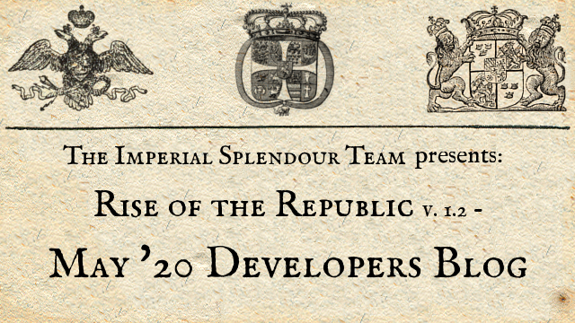
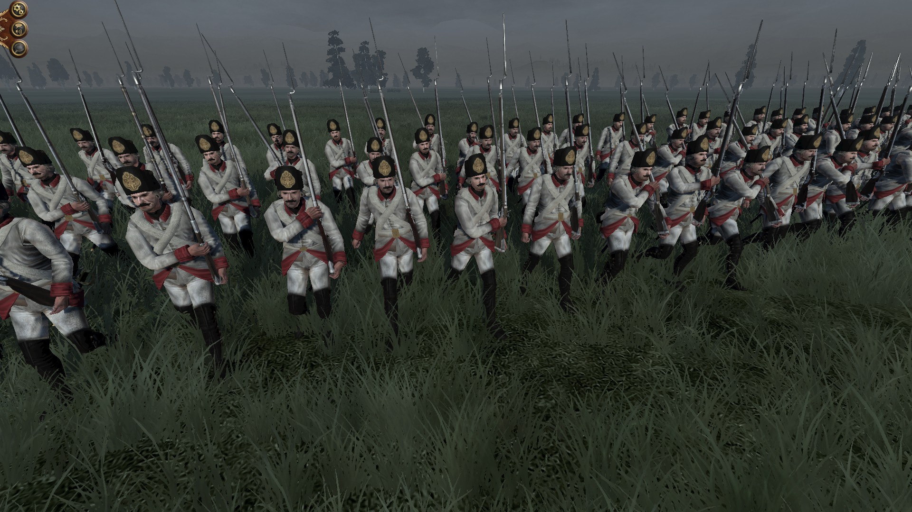
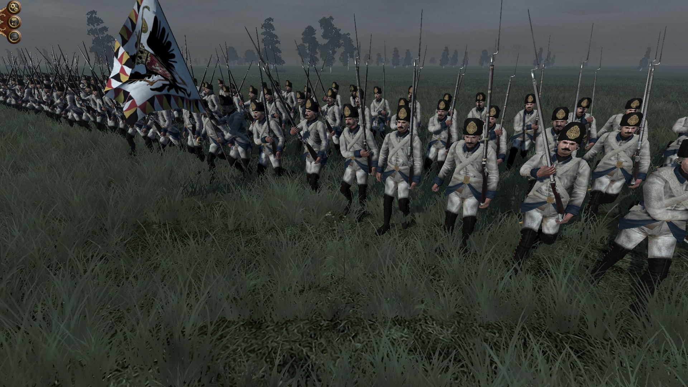
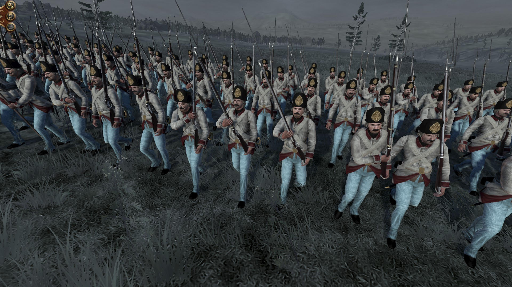
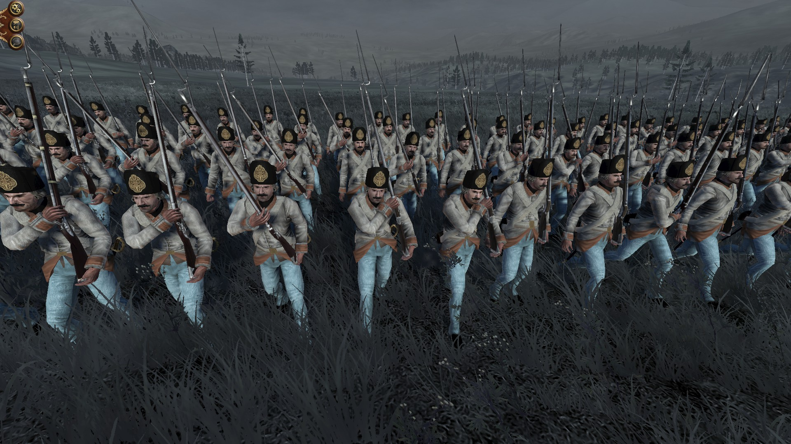
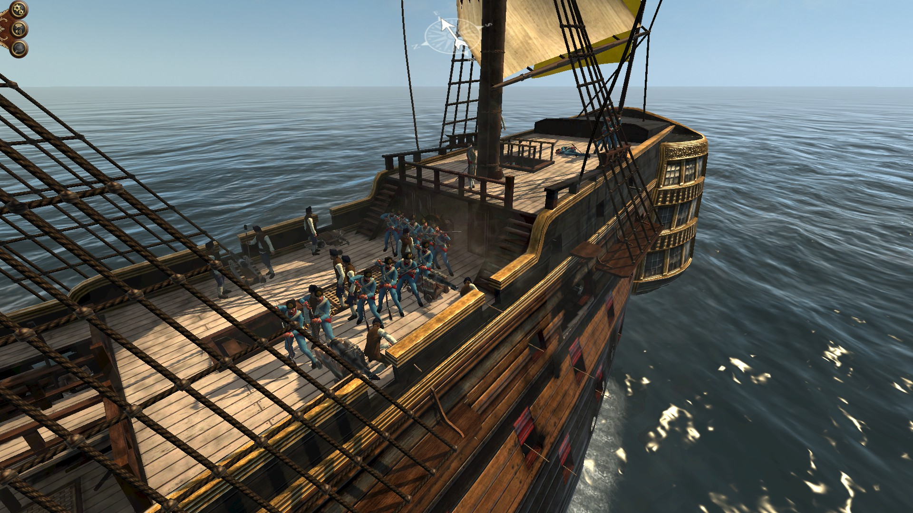
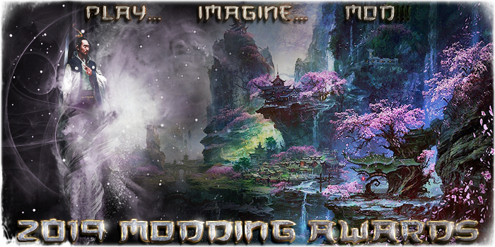

We know, there haven't been an update or a Developers blog for a long time. But time is a limiting issue when modding. 

Furthermore, we want to release a clean version 1.2 and not another beta. 

But many things have been made in the background. In order the give the AI the ability to make use of conquered regions we centralised the building chains. So not every faction has his own building chain any more. All factions share the same chains, just the Prestige Buildings, localisation, models and UI are different.

This model of the town hall of Coburg will serve as a generic town hall:

<iframe width="640" height="480" src="https://sketchfab.com/models/b65305da47c947f2893b160f70d114ce/embed?preload=1&amp;ui_controls=1&amp;ui_infos=1&amp;ui_inspector=1&amp;ui_stop=1&amp;ui_watermark=1&amp;ui_watermark_link=1" frameborder="0" allow="autoplay; fullscreen; vr" mozallowfullscreen="true" webkitallowfullscreen="true"></iframe>

[Rathaus Coburg](https://sketchfab.com/3d-models/rathaus-coburg-b65305da47c947f2893b160f70d114ce?utm_medium=embed&utm_source=website&utm_campaign=share-popup) by [QuintusHortensiusHortalus](https://sketchfab.com/QuintusHortensiusHortalus) on [Sketchfab](https://sketchfab.com)

And this is the final model of the special Brunswick building chain:

<iframe width="640" height="480" src="https://sketchfab.com/models/9e23ff7bb7234c25920a5b1cd7e3a149/embed?preload=1&amp;ui_controls=1&amp;ui_infos=1&amp;ui_inspector=1&amp;ui_stop=1&amp;ui_watermark=1&amp;ui_watermark_link=1" frameborder="0" allow="autoplay; fullscreen; vr" mozallowfullscreen="true" webkitallowfullscreen="true"></iframe>

[Altes Braunschweiger Schloss](https://sketchfab.com/3d-models/altes-braunschweiger-schloss-9e23ff7bb7234c25920a5b1cd7e3a149) by [QuintusHortensiusHortalus](https://sketchfab.com/QuintusHortensiusHortalus) on [Sketchfab](https://sketchfab.com)

Also, many descriptions were added and the website received a complete overhaul. Many bugs you reported were fixed and we try to improve the overhaul quality of the mod. 

And many things will be new in the next version and mods like iporto9393's [Train your Generals at Schools! -&- Fixed Trait and Ancillary Triggers](https://www.twcenter.net/forums/showthread.php?798721-SUBMOD-Train-your-Generals-at-Schools!-amp-Fixed-Trait-and-Ancillary-Triggers) will be incorporated in 1.2.

In addition, those guys will be part of RotR 1.2 as a little anticipation of RotR 1.3:

The basic model was made by Flikitos long ago with some slight adaptions made by me. 

Furthermore, the Total War Center 2019 Modding Awards are now live. Check it out by clicking on the picture or the link below.

)

https://www.twcenter.net/forums/showthread.php?804369-2019-MODDING-AWARDS-VOTING-POLLS-ARE-UP-(links-inside!)

### Thank you for your patience!

