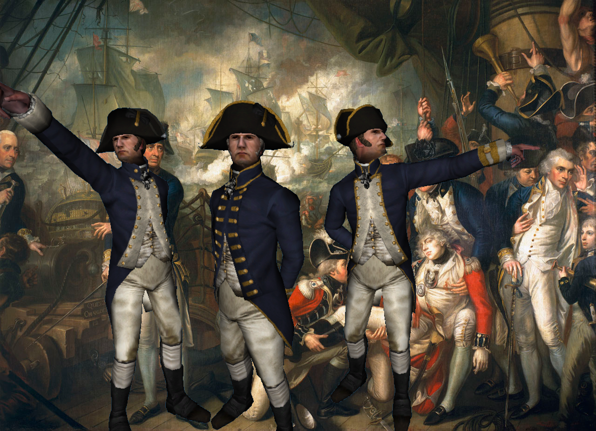
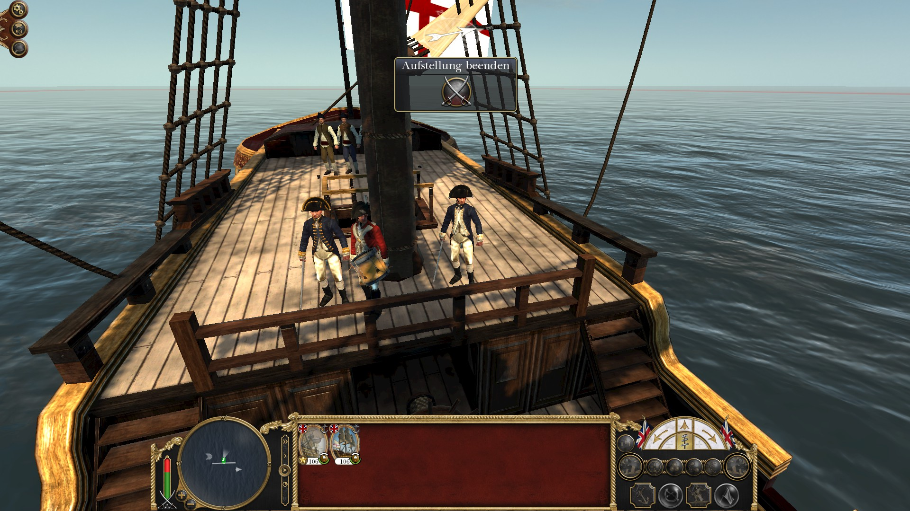
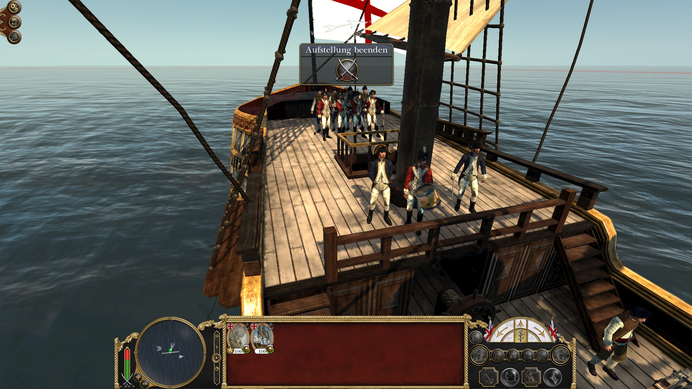
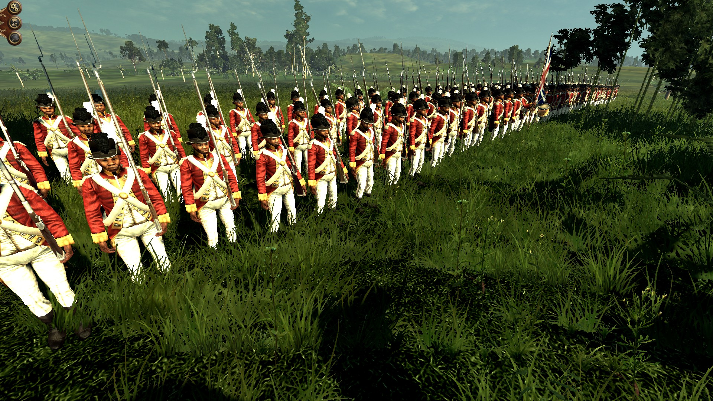
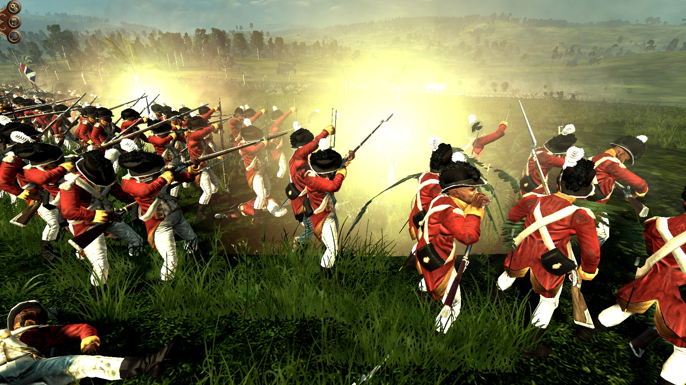

Here they are, long-awaited British Naval officers in the 1787 uniform regulation uniforms:

To left is the lieutenant, in the middle the admiral (vice-admiral to be precise, he has two rows of gold lace on his cuffs) and to the right is the captain (full-captain, meaning he has three years seniority on the list). 

To see a real coat of a full-captain follow this [link to the Royal Museums Greenwich - National Maritime Museum](https://collections.rmg.co.uk/collections/objects/71232.html)

These are the officers in-game:

That's not all news for Great Britain. We will also look into the British units in the Americas in order to avoid that Great Britain can spawn huge amounts of well-trained units. During making this, new British colonial units will be provided as the West India Regiments:

And here they are in action:

The recruitment of those units recruited from the black slave on the plantations is restricted to the West Indies and on every island, you can recruit a few. According to 18th century society, the regiments are commanded by white officers.

Furthermore here are all new generic European building models which are currently completed in will be in the next update:

<iframe width="640" height="480" src="https://sketchfab.com/models/94107c75670b42b6b5cf70233e1f2276/embed?preload=1&amp;ui_controls=1&amp;ui_infos=1&amp;ui_inspector=1&amp;ui_stop=1&amp;ui_watermark=1&amp;ui_watermark_link=1" frameborder="0" allow="autoplay; fullscreen; vr" mozallowfullscreen="true" webkitallowfullscreen="true"></iframe>

[Generic Building Models](https://sketchfab.com/3d-models/generic-building-models-94107c75670b42b6b5cf70233e1f2276?utm_medium=embed&utm_source=website&utm_campaign=share-popup) by [QuintusHortensiusHortalus](https://sketchfab.com/QuintusHortensiusHortalus) on [Sketchfab](https://sketchfab.com)

Finally, I have some news about the followers, each will get its little icon. Here you can see some:

Some are caricatures (especially by Thomas Rowlandson and William Hogarth) and some are paintings or sketches, we hope you like them.

### Thank you for your patience!

Visit us on 

[TWCenter](http://www.twcenter.net/forums/forumdisplay.php?1138-Imperial-Splendour), [Facebook](https://www.facebook.com/imperialsplendour/), [Twitter](https://twitter.com/SplendourTeam) and 

