

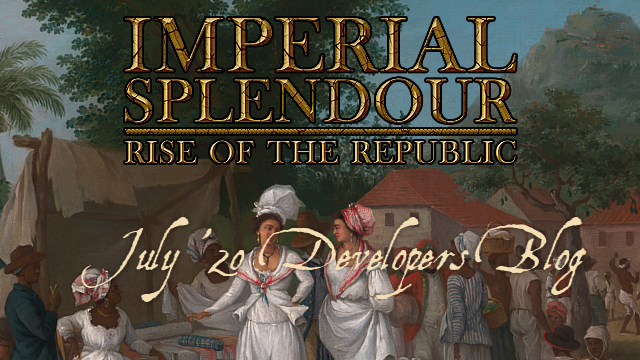

#### Today we present you the latest work from June, featuring mostly colonial units in the West Indies.

As the West India Regiment was already in the June blog let's start with the British units!

The first units are the Black light infantry in 2 variants: Loyal Black Rangers, recruitable in the original British colonies and Black Chasseurs, recruitable in the other colonies. Both units have a bonus in fighting in the West Indies:

#### Loyal Black Rangers:

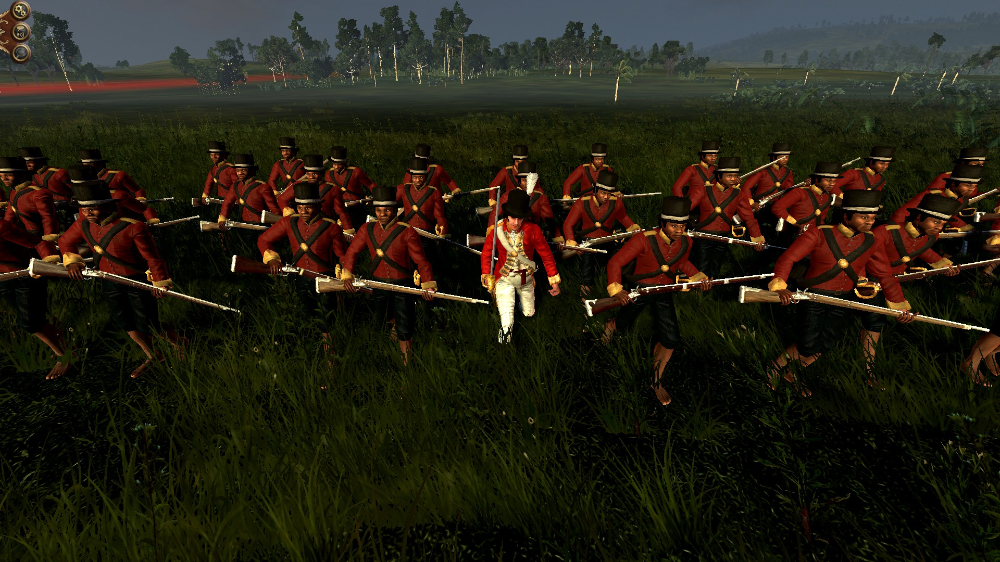

#### Black Chasseurs:

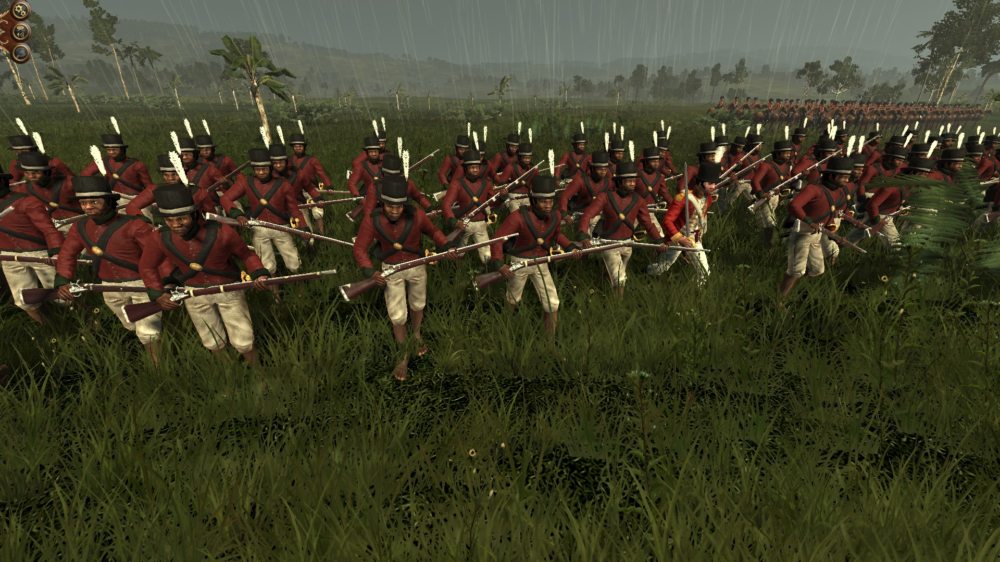

Also the British can recruit a cavalry unit in Hispaniola and Cuba, the Uhlans Britannique. Historically they were recruited for service in Hispaniola in Europe as an auxiliary unit for the British campaign in Hispaniola. Due to the climate in the West Indies and the yellow fever many men died. Therefore the unit has only 60 men.

#### 
Uhlans Britannique:

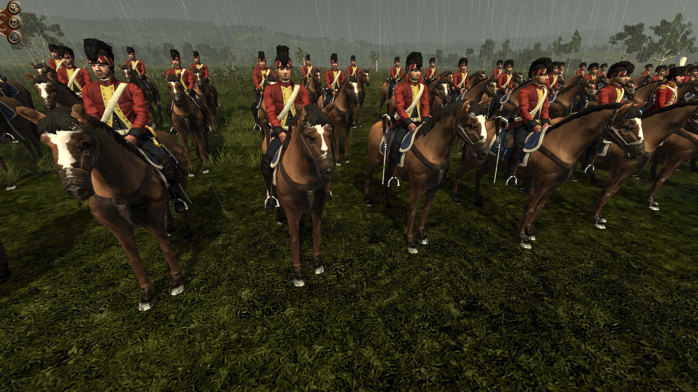

Also, all factions will have access to some generic colonial units in the West Indies, here are the first 2:

#### Generic Black Chasseurs:

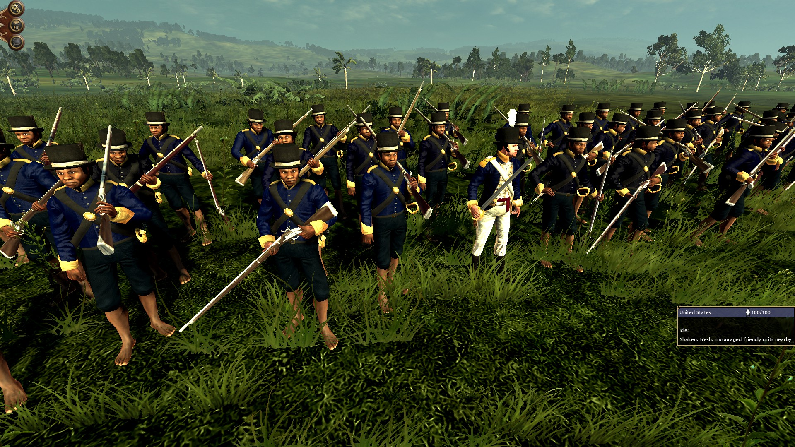

#### Generic White Planter Militia:

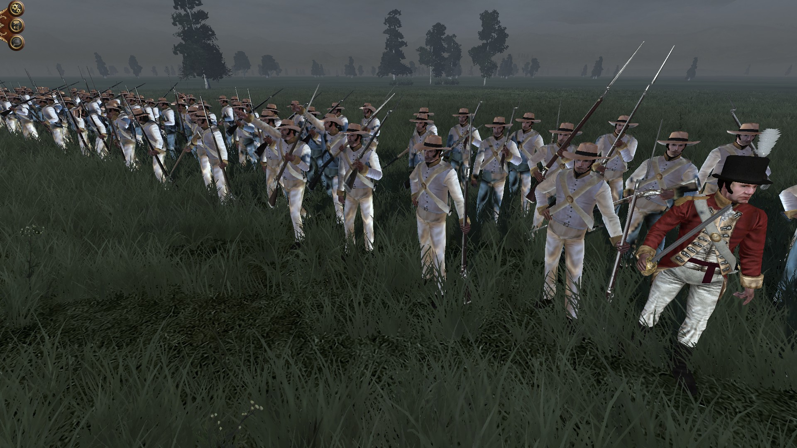

As you can see, we also created a generic white officer for all West India units.

But that's not all. Finally, the British Highlander Light Infantry is done!

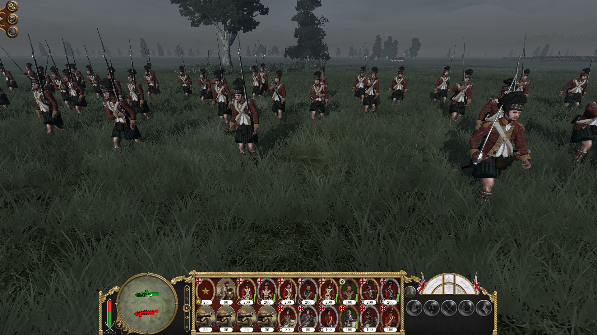

Also, the Guards have now a light infantry unit replacing the light infantry of the Marines:

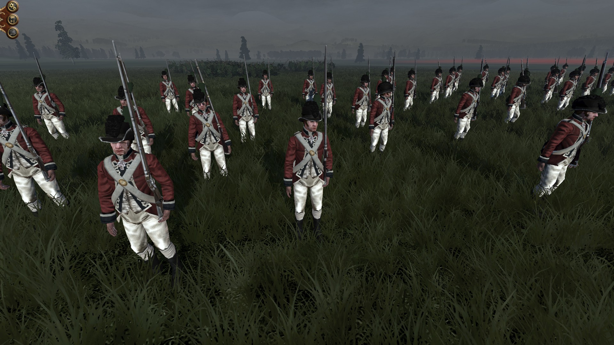

The 42nd Regiment of Foot, the Black Watch, received an update on their uniforms. They have now the correct lace around their buttonholes.

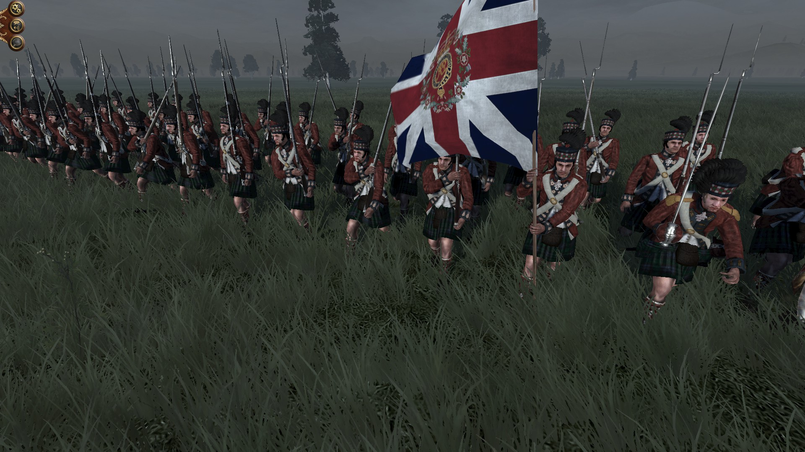

#### Here are the unit icons:

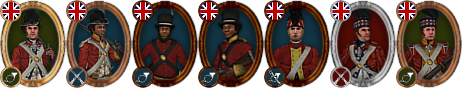

1. Guards Light Infantry 
2. West India Regiment
3. Black Chasseurs
4. Loyal Black Rangers
5. Uhlans Britannique
6. 42nd Regiment of Foot 'Black Watch'
7. Highlanders Light Infantry

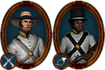

1. Black Chasseurs
2. White Planters Militia

- - -

As already announced iporto9393's [Train your Generals at Schools! -&- Fixed Trait and Ancillary Triggers](https://www.twcenter.net/forums/showthread.php?798721-SUBMOD-Train-your-Generals-at-Schools!-amp-Fixed-Trait-and-Ancillary-Triggers) mod will be added in the next update. Among other things, it adds new followers. Some followers are created also only for RotR. Here are all new followers:

#### For Admirals:

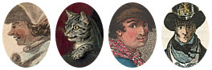

1. Steward - A Steward cares for the needs of his master.
2. Ship's cat - A cat is on a ship to control the population of rats and therefore prevent the provisions from being eaten.
3. Coxwain - A coxswain is the man who steers a ship. But a loyal coxswain is much more. He commands the personal barge crew of his captain or admiral, follows him from ship to ship and can even act as his bodyguard.
4. Boatswain - The boatswain had responsibility for rigging, cables, anchors, sails and boats. They were not eligible to command ships but could stand watches. They were less educated than the more senior warrant officers, although they needed to keep accounts. But access to the ship's stores comes to a price...

Note that each admiral can have only one follower out of the first three.

#### For Generals:

1. Influential Cousin - This man has influential relatives. In the world of the 18th century where kinship is a mayor factor in promotion having influential relatives is important. This secures future advancement even when having no talents at all. The cousin also attracts persons without a patron seeking patronage.
2. Drummer - A drummer is needed to let the soldiers march in cadence. He gives provides the speed of the march. But he acts as a battlefield medic too.
3. Fifer - A fifer is needed to cheer up the men with his tunes. But he acts as a battlefield medic too.
4. Trumpeter - A trumpeter signals a cavalry unit how to move. Also, the sound encourages the men.
5. Matador (only available for Spanish and Portuguese generals)

#### For Scholars:

1. Female Doctoral Candidate
2. Interested Wife

Especially the last to followers based on Historical people, especially [Dorothea Schlözer](https://en.wikipedia.org/wiki/Dorothea_von_Rodde-Schl%C3%B6zer) and [Marie-Anne Paulze Lavoisier](https://en.wikipedia.org/wiki/Marie-Anne_Paulze_Lavoisier). Both followers are very rare but they both give a bonus on the research speed and the Female Doctoral Candidate gives an additional bonus on the ability to research techs from the Philosophy tech-tree.

- - -

Also, Pike's AI is also in the next update (thanks to myfate!) but there is a little issue we have to fix. This also answers when the next release is - not before we can fix the issue.

We will keep you posted on our progress!

### Thank you for your patience!

Visit us on 

[TWCenter](http://www.twcenter.net/forums/forumdisplay.php?1138-Imperial-Splendour), [Facebook](https://www.facebook.com/imperialsplendour/), [Twitter](https://twitter.com/SplendourTeam) and 

