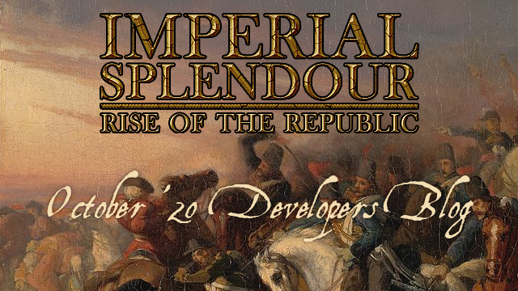
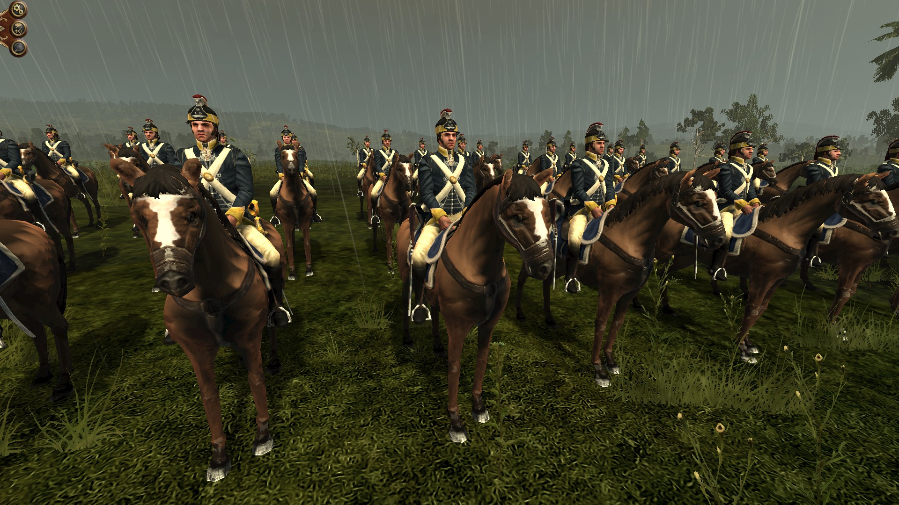
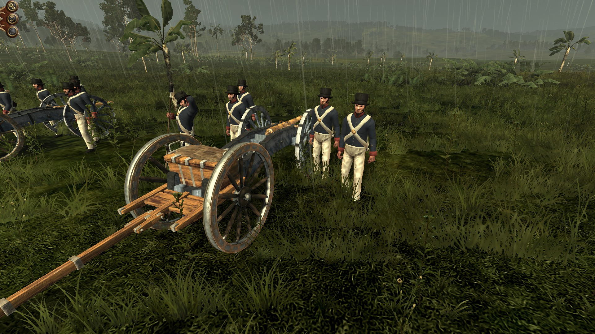
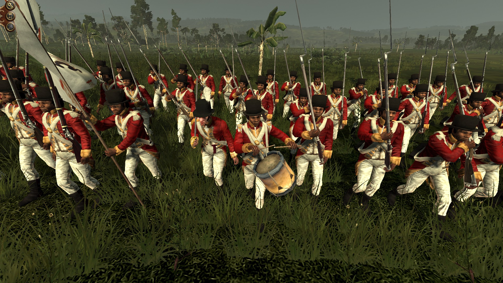
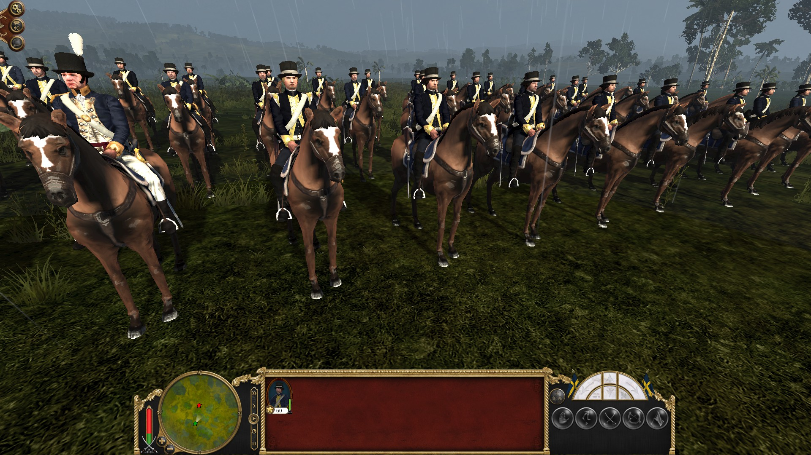
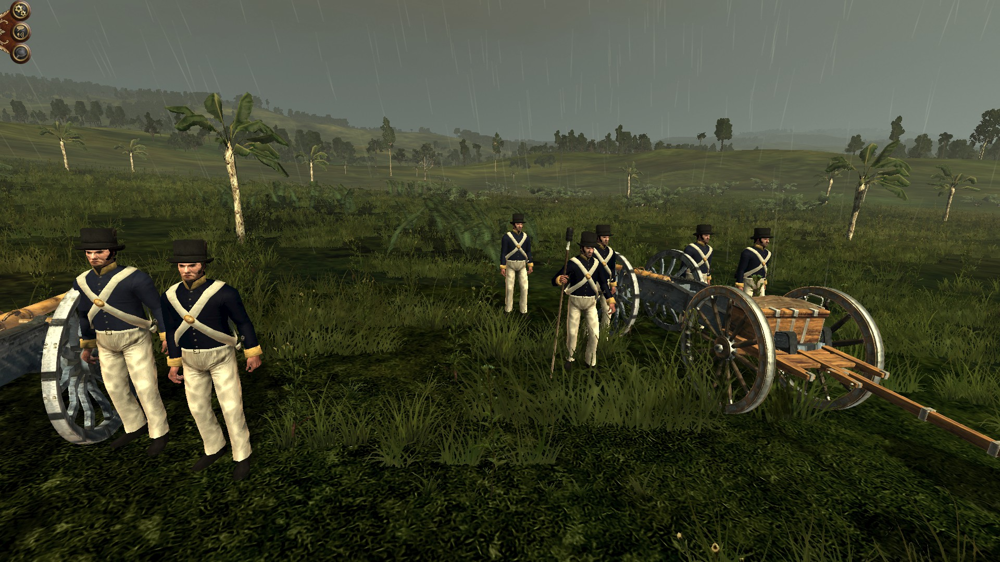
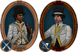
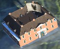
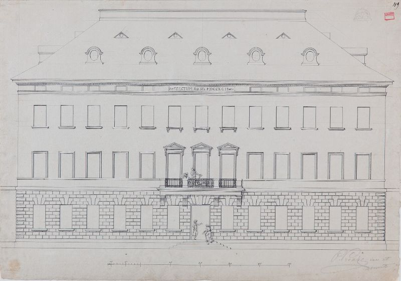
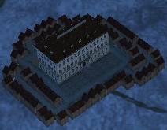

The last British and generic units for the West Indies are done! 

At first the British:

#### 
20th (Jamaica) Regiment of (Light) Dragoons:

The 20th (Jamaica) Regiment of (Light) Dragoons was raised in 1792 for service in Jamaica. It saw service in the Second Maroon War. The regiment was equipped with a special helmet similar to French infantry helmets around the revolution. At the front was a badge with the regimental number and the regimental insignia - a crocodile - referring to Jamaica.

Here is the in-game icon:

The other - and last - British unit is the West Indies Militia artillery. This means in the West Indies you can only recruit some 6 pounder guns with inferior stats. Proper artillery has to be shipped from Europe!

And here are the final generic West Indies units:

#### 
Generic West India Regiment

#### 
Generic West India Light Dragoons

#### 
Generic West India Militia Artillery

Here are the in-game icons:

#### Furthermore, I have 2 new buildings for you:

    <iframe title="A 3D model" width="640" height="480" src="https://sketchfab.com/models/654ebe09e62b4cd890029af3150c429b/embed?autostart=0&amp;ui_controls=1&amp;ui_infos=1&amp;ui_inspector=1&amp;ui_stop=1&amp;ui_watermark=1&amp;ui_watermark_link=1" frameborder="0" allow="autoplay; fullscreen; vr" mozallowfullscreen="true" webkitallowfullscreen="true"></iframe>

[Schloss Lütetsburg](https://sketchfab.com/3d-models/schloss-lutetsburg-654ebe09e62b4cd890029af3150c429b) by [QuintusHortensiusHortalus](https://sketchfab.com/QuintusHortensiusHortalus) on [Sketchfab](https://sketchfab.com)

The Schloss Lütetsburg is located in Lütetsburg near Norden in East Frisia in Germany. Attached to the palace is a large English Landscape Garden - the oldest one in Germany and it still exists! Originally a castle was located on the place the palace was erected. The moat is still from the time when the palace was a castle. The castle was destroyed in 1514 and a Rennaisecance palace was built on its place. But at the end of the 17th century, the palace was ailing and the palace I recreated was built. In the 1790s the famous English Landscape Garden attached to the palace was shaped. Nearly 100 years later a Christmas tree fell and the palace burned down. Another palace was built. This new palace shared the same fate and burned down in 1956. So today’s palace is, in fact, a modern building from the 1950s whereas the garden is 160 years older.

It'll serve as the highest level farm building.  This is the in-game Empire Total War model:

    <iframe title="A 3D model" width="640" height="480" src="https://sketchfab.com/models/ee662d148fff46d9b8e8f180fbf82210/embed?autostart=0&amp;ui_controls=1&amp;ui_infos=1&amp;ui_inspector=1&amp;ui_stop=1&amp;ui_watermark=1&amp;ui_watermark_link=1" frameborder="0" allow="autoplay; fullscreen; vr" mozallowfullscreen="true" webkitallowfullscreen="true"></iframe>

[Peter Joseph Krahe - Draft of a Palace](https://sketchfab.com/3d-models/peter-joseph-krahe-draft-of-a-palace-ee662d148fff46d9b8e8f180fbf82210) by [QuintusHortensiusHortalus](https://sketchfab.com/QuintusHortensiusHortalus) on [Sketchfab](https://sketchfab.com)

This draft of a palace was made by the architect [Peter Joseph Krahe](https://en.wikipedia.org/wiki/Peter_Joseph_Krahe) in 1792. I modelled the building after this front plan:

from the Städtisches Museum Braunschweig (all credits go to them for the picture, the original can be found [here](https://kulturerbe.niedersachsen.de/objekt/record_kuniweb_414322/1/LOG_0000/#record_kuniweb_414322) ).

For the colours of the facade, I used the current colour scheme of the [Wangenheim Palais](https://de.wikipedia.org/wiki/Wangenheimpalais) in Hannover as it is also a Classicist building and has a certain similarity.

The building serves as generic Governors palace in the Empire Total War mod Imperial Splendour. This is the in-game model:

### We will keep you posted on our progress!

### Thank you for your patience!

Visit us on 

[TWCenter](http://www.twcenter.net/forums/forumdisplay.php?1138-Imperial-Splendour), [Facebook](https://www.facebook.com/imperialsplendour/), [Twitter](https://twitter.com/SplendourTeam) and 

