

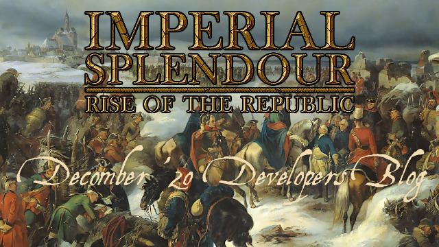

It's time for a little blog on the 3rd Advent. This time it's mostly about units and another little gift. 

### To the units:

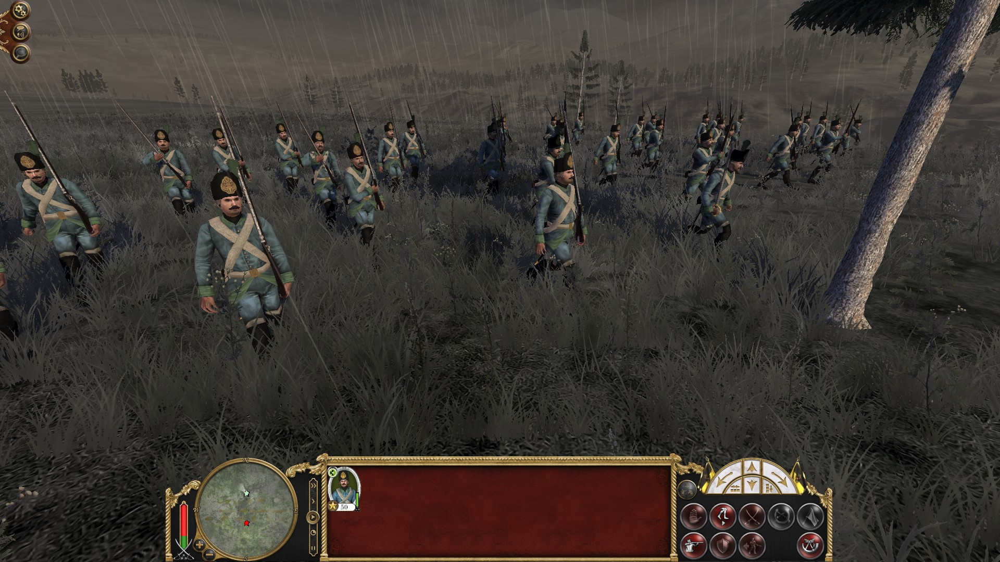

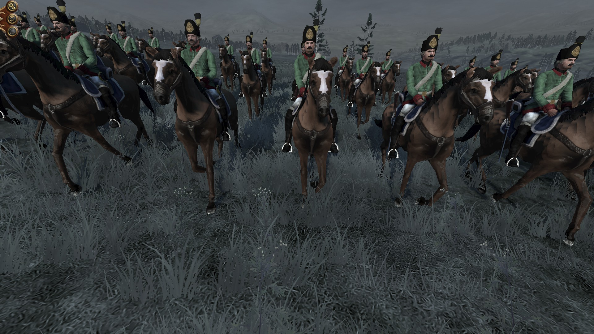

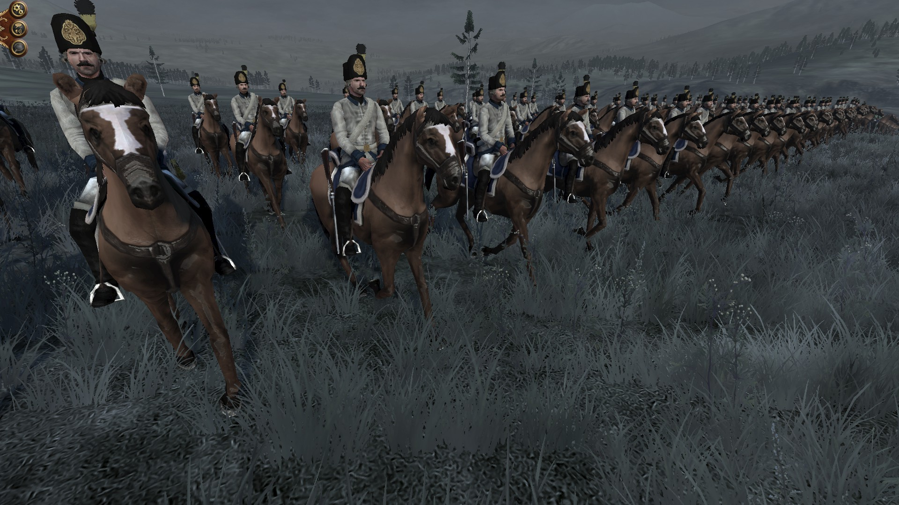

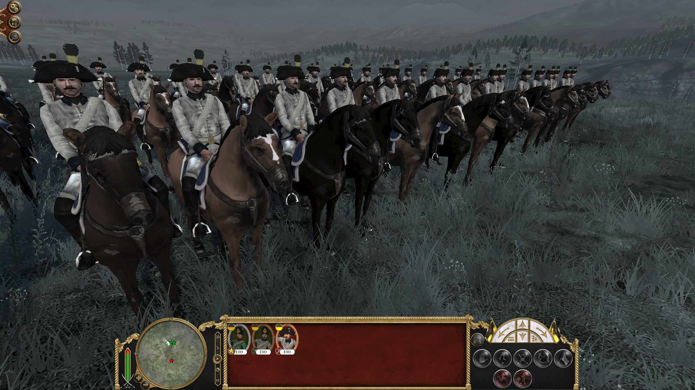

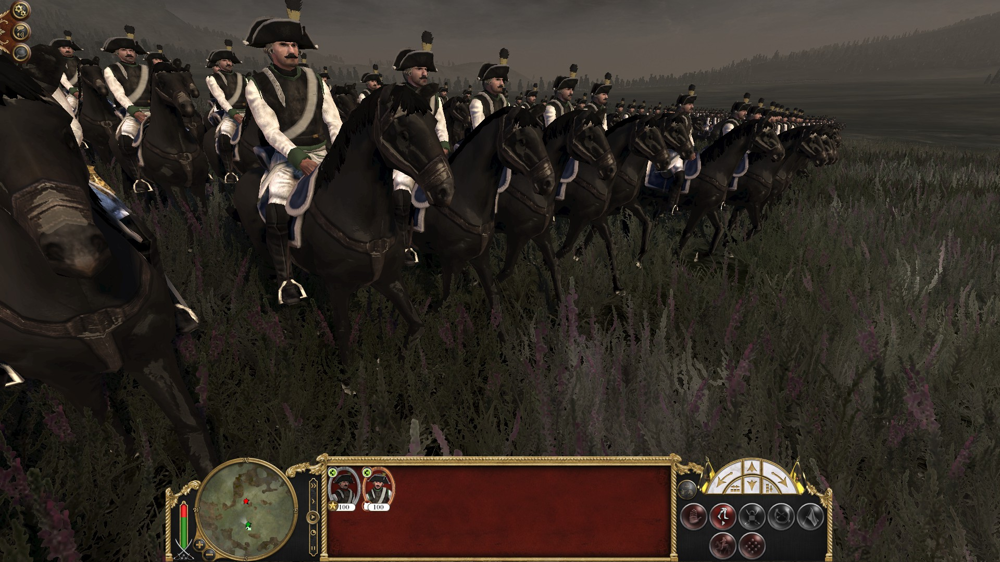

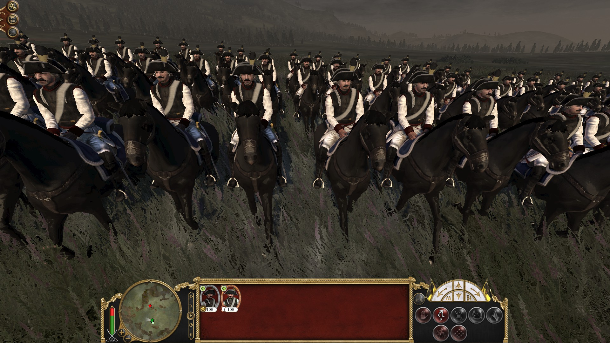

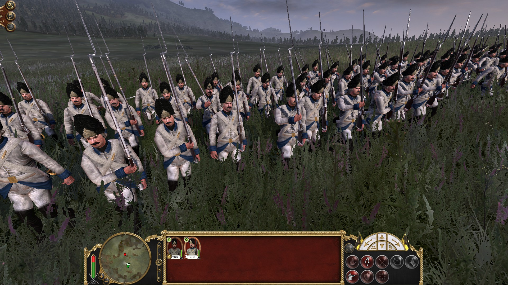

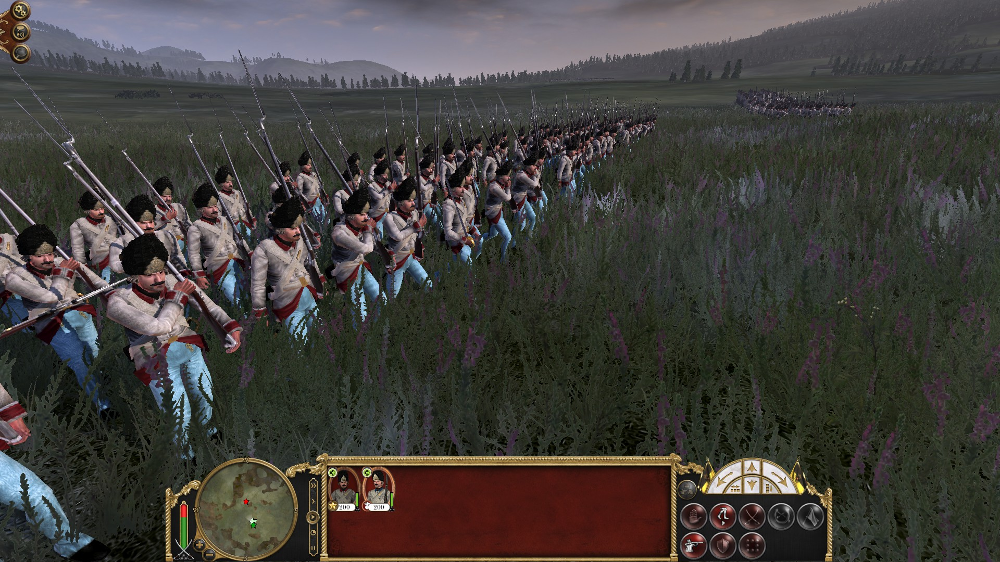

### And here are the Icons:

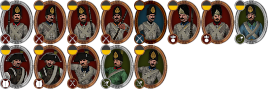

### Furthermore, I have a new building for you:

#### The level 5 generic Parliament Building:

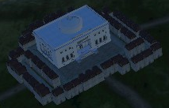

### But now to the promised surprise:

As most things are done, we decided to assemble a **closed beta**. So if you want to hunt some bugs or simply test the new version you can contact us via [Message on TWC](https://www.twcenter.net/forums/private.php?do=newpm&u=120089), [Message on ModDB](https://www.moddb.com/messages/compose?to=QuintusHortensius), our facebook and twitter pages or E-Mail (info@imperialsplendour.com). What we want you to do is simply report all bugs you find and give us some feedback on the gameplay.

That's all for today, have a nice 3rd Advent!

### We will keep you posted on our progress!

### Thank you for your patience!

Visit us on 

[TWCenter](http://www.twcenter.net/forums/forumdisplay.php?1138-Imperial-Splendour), [Facebook](https://www.facebook.com/imperialsplendour/), [Twitter](https://twitter.com/SplendourTeam) and 

