During the past months, many minor things were fixed. But also some final larger changes were incorporated. 

Now all units from already done factions are balanced. So each nation has now units representing the quality of their armed forces in the late 18th century. This means as an example that the French monarchy has a rather good cavalry and a weaker infantry. On the contrary, the British cavalry is very weak but the British infantry has good shooting skills.

Also, a large amount of new descriptions have been added by The Shark. He also corrected the starting provinces. So Spain owns now Louisiana, Austria Milan and France got - as compensation - Hispaniola.

Sir John Barlow and myfate worked on the naval side. Thanks to Sir John Barlow we will be able to present maybe the most magnificent navies you have ever seen.

Here Sir John Barlow tested some of his work: 

"The AI responds pretty well against player's formations if the wind is followed. In this picture, the AI made a 180 degree "S" turn around the wind making use of 3 groups (which can be seen nearest to the camera). While I opted for a straight attack between their vanguard and middle squadrons (which didn't end well as my two columns were too close to make the 90-degree turn needed in order to form a competent line of battle)."

; Triumph Class Heavy 3rd Rate (74 guns)")

Some of the new textures for early British ships. From left to right: HMS Victory 1765; Barfleur Class 2nd Rate (98 guns); Triumph Class Heavy 3rd Rate (74 guns).

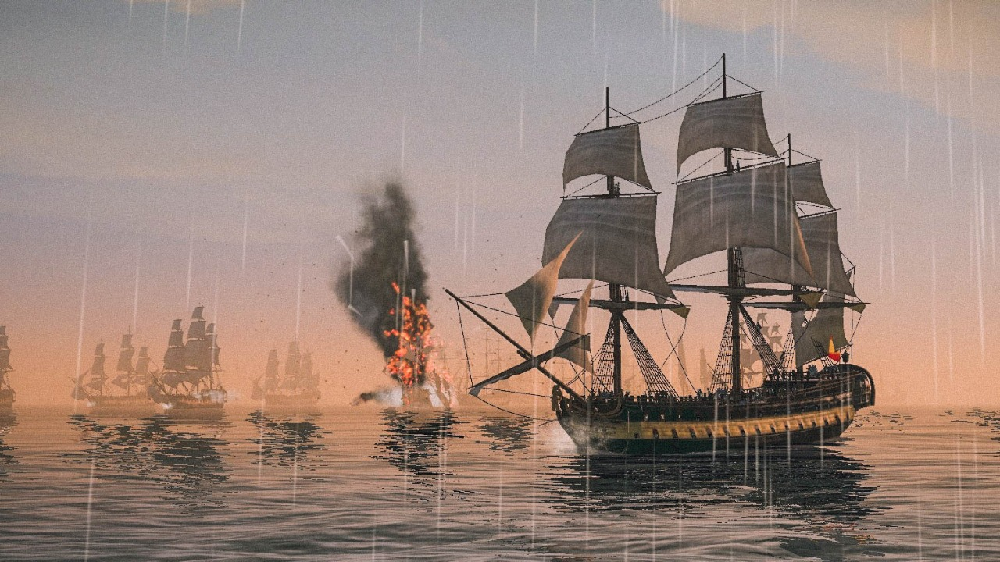

A Spanish 3rd rate watches his French ally's flagship explode. The colour pattern on the Spanish ship corresponds to the "Triunfante Class" 68-gunner ship of the line which will be available since the start of the campaign.

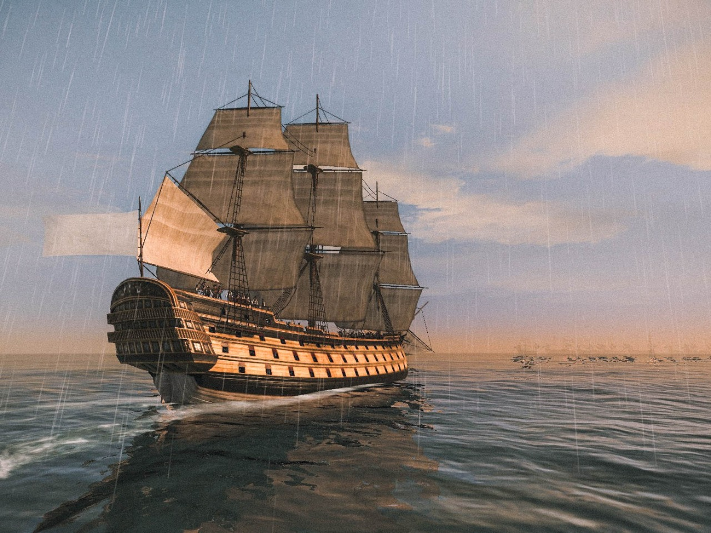

A French 1st rate sails against an enemy squadron. The ship depicted here corresponds to a "Terrible Class" 106-gunner ship of the line, using a colour pattern inspired by "Le Bretagne (1766)". This class consists of two ships that will be available since the start of the campaign.

Furthermore, Great Britain got a new flag when turning into a Republic:

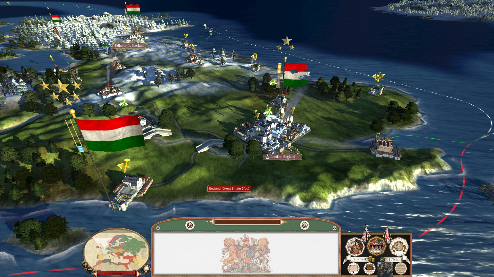

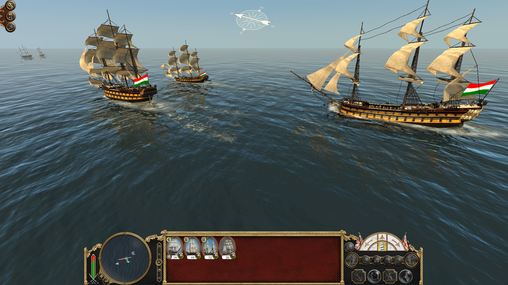

[The flag was used by British republicans in the early 19th century.](https://en.wikipedia.org/wiki/Republicanism_in_the_United_Kingdom#Revolutionary_republicanism,_1800%E2%80%931848)

Also, some missing gaps in the land units were filled. The British Rifle Corps got its own officers with a fancy uniform:

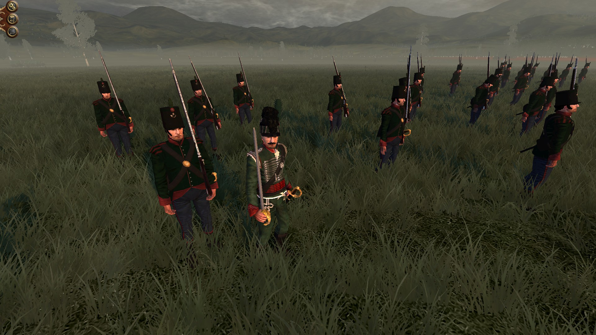

The British artillery wears now a bicorne:

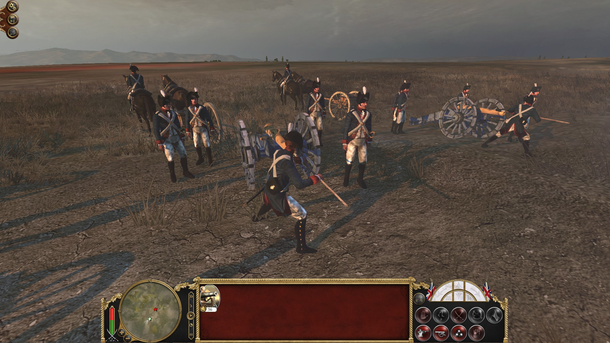

And the Danish have their own white infantry regiments in the West Indies. Although the fighting abilities of those regiments are questionable regarding the number of men is already depleted by the yellow jack and other infections. Their officers are obviously also not the finest...

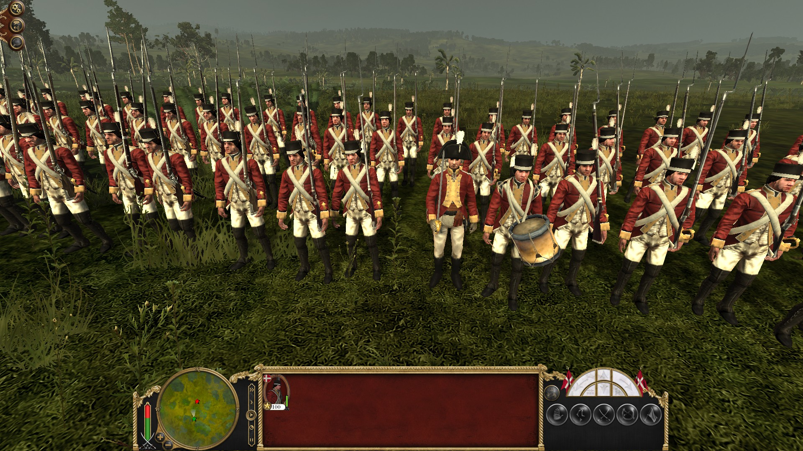

The will to fight is beyond question for the following guys! Haiti has now black officers:

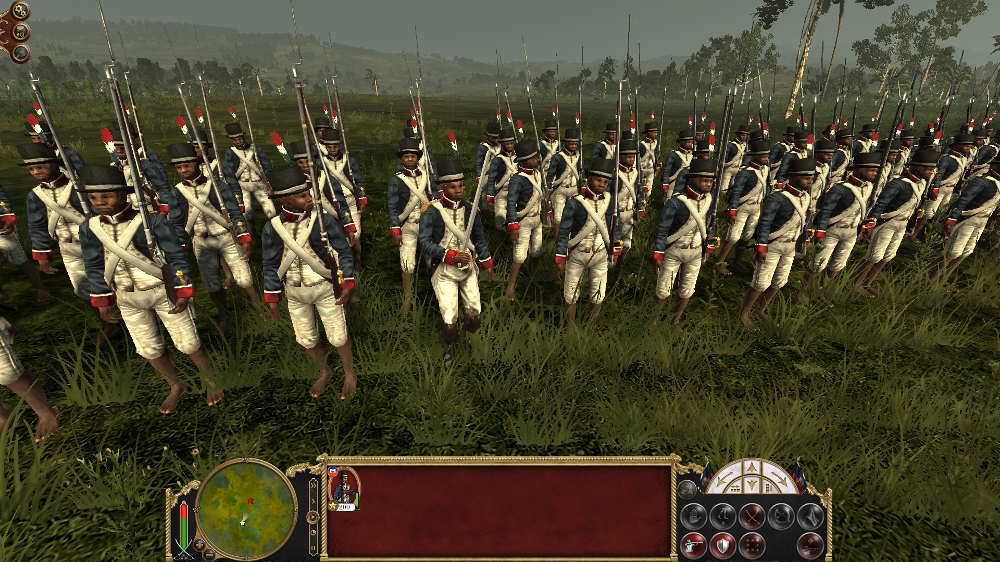

France also got some updates:

The Légion Dabrowski has now a uniform for the famous Lancers:

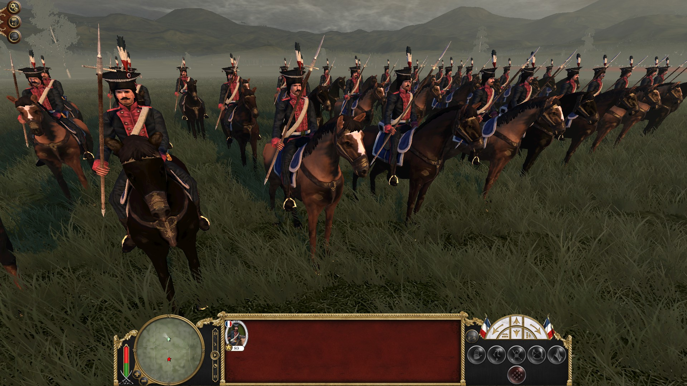

And the texture for the Légion Noire has been optimized:

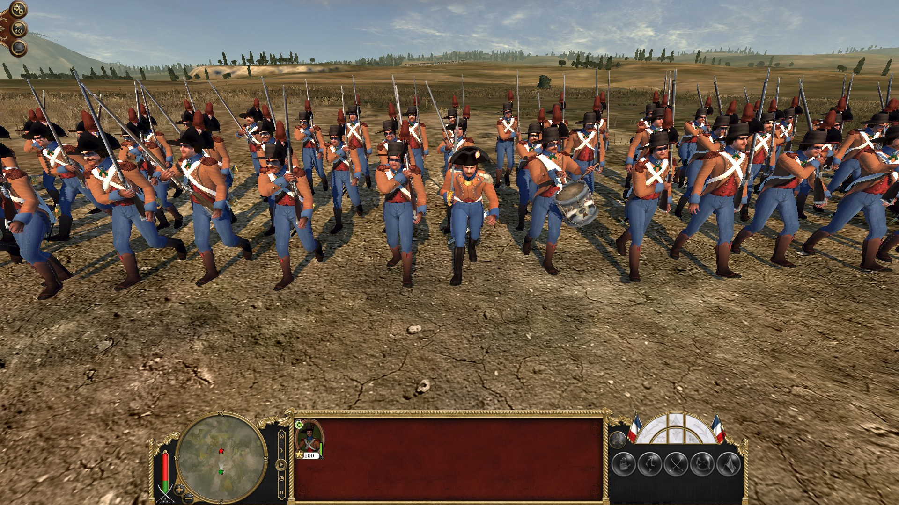

Some new tech info pics and eventpics will also be part of the next update:

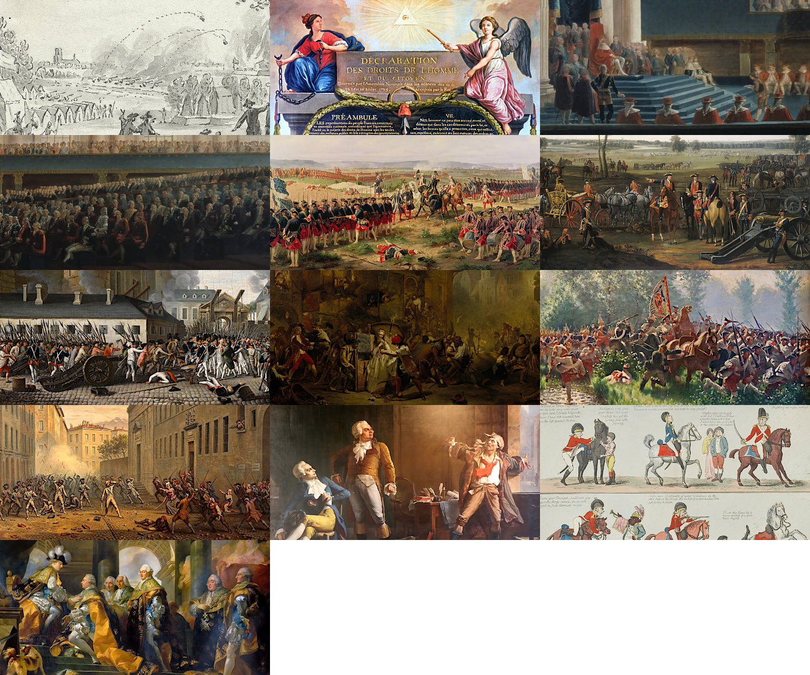

1. Artillery Training Camp
2. Déclaration des Droits de l’Homme et du Citoyen
3. Sweden Restauration Monarchy
4. Sweden Age of Liberty
5. France Infantry Monarchy
6. British Artillery
7. Revolution
8. Riot
9. Unit rooting
10. Strike
11. France Revolution Discussion
12. British Cavalry
13. France late absolutism

Finally, many the generic government building chain and the Brunswick building chain got all new building models:

<iframe width="640" height="480" title="Generic Building Models 2" frameborder="0" allowfullscreen mozallowfullscreen="true" webkitallowfullscreen="true" allow="fullscreen; autoplay; vr" src="https://sketchfab.com/models/b41e6d2ca5924d64a1b45a786f8c8d5b/embed">
</iframe>

<a href="https://sketchfab.com/3d-models/generic-building-models-2-b41e6d2ca5924d64a1b45a786f8c8d5b?utm_medium=embed&utm_campaign=share-popup&utm_content=b41e6d2ca5924d64a1b45a786f8c8d5b" target="_blank">Generic Building Models 2</a>
by <a href="https://sketchfab.com/QuintusHortensiusHortalus?utm_medium=embed&utm_campaign=share-popup&utm_content=b41e6d2ca5924d64a1b45a786f8c8d5b" target="_blank">QuintusHortensiusHortalus</a>
on <a href="https://sketchfab.com?utm_medium=embed&utm_campaign=share-popup&utm_content=b41e6d2ca5924d64a1b45a786f8c8d5b" target="_blank">Sketchfab</a>

<iframe width="640" height="480" title="Brunswick Building Chain" frameborder="0" allowfullscreen mozallowfullscreen="true" webkitallowfullscreen="true" allow="fullscreen; autoplay; vr" src="https://sketchfab.com/models/21c7abef0980434e82e61e307299301f/embed">
</iframe>

<a href="https://sketchfab.com/3d-models/brunswick-building-chain-21c7abef0980434e82e61e307299301f?utm_medium=embed&utm_campaign=share-popup&utm_content=21c7abef0980434e82e61e307299301f" target="_blank">Brunswick Building Chain</a>
by <a href="https://sketchfab.com/QuintusHortensiusHortalus?utm_medium=embed&utm_campaign=share-popup&utm_content=21c7abef0980434e82e61e307299301f" target="_blank"">QuintusHortensiusHortalus</a>
on <a href="https://sketchfab.com?utm_medium=embed&utm_campaign=share-popup&utm_content=21c7abef0980434e82e61e307299301f" target="_blank">Sketchfab</a>

### We will keep you posted on our progress!

### Thank you for your patience!

Visit us on 

[TWCenter](http://www.twcenter.net/forums/forumdisplay.php?1138-Imperial-Splendour), [discord](https://discord.gg/sY7CCbcH), [Facebook](https://www.facebook.com/imperialsplendour/), [Twitter](https://twitter.com/SplendourTeam) and 

