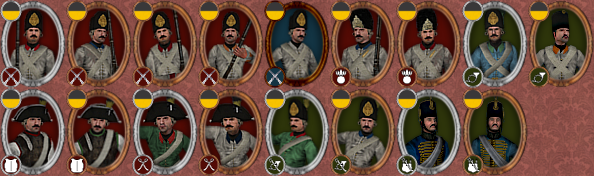

## Hurry up admiral, the fleet is awaiting your command!

Today 224 years ago the Battle of the Nile started. Is there a better day to release Imperial Splendour - Rise of the Republic v. 1.2?

So here it is, after 3 years of hard work, Rise of the Republic 1.2 - Northern Wars Update. 

## [Download RotR 1.2 here](https://imperialsplendour.com/download)

**Just install the mod by following the installer / the instructions provided and let the first turn of a campaign pass without doing anything. That's important as the game grooves itself in!**

So what's in it? Of course the 3 Northern European factions: Sweden, Denmark and Russia. Everything done on them is already disclosed in the previous blogs. So if you want to have a look, scroll through our blogs or this one might be a bit crowded.

But not just that, the whole AI got a rework. Also, the armies of Spain and Austria partly await your command! 

Here is the Austrian army:

And the Spanish (without colonial units, note that the rooster is in an early stage, models and texture can change with the next updates):

As the Hanoverian army is one of the oldest in the mod, it got a full rework with improved textures and models.

We also wrote tons of descriptions. In total descriptions numbering around 50.000 words were added. Furthermore, hundreds of new generic portraits have been added. Have a look at them below:

New building chains and buildings are also part of the update which help you to balance your economy, armed forces and happiness. Also, the new models simply look better! Here is an example:

 
<iframe title="Arts and Science building chains" frameborder="0" width="640" height="480"  allowfullscreen mozallowfullscreen="true" webkitallowfullscreen="true" allow="autoplay; fullscreen; xr-spatial-tracking" xr-spatial-tracking execution-while-out-of-viewport execution-while-not-rendered web-share src="https://sketchfab.com/models/30467c0593ba45379a013d3f78430121/embed"> </iframe> 

[Arts and Science building chains](https://sketchfab.com/3d-models/arts-and-science-building-chains-30467c0593ba45379a013d3f78430121?utm_medium=embed&utm_campaign=share-popup&utm_content=30467c0593ba45379a013d3f78430121) by [QuintusHortensiusHortalus](https://sketchfab.com/QuintusHortensiusHortalus) on [Sketchfab](https://sketchfab.com)

Staying for a moment with the campaign, we change the possession of regions in order to create a historically accurate world. Many regions have changed ownership mostly in the Americas:

But we didn't only add new stuff. Many things from the previous version had to be fixed and we did. So no more weird textures, no more canons turning black when destroyed and weird fire drills. 

The soundtrack is completely reworked too. The soundtrack is still a Classical music soundtrack and uses calmer music for the campaign (mostly Piano music), more vivid (for example two marches from Beethoven) and full orchestra music for the land battles and finally mostly string quartets/quintets for naval battles. Overall the soundtrack was expanded with much more pieces than before. You can find a full list of used tracks below. 

Last but not least: 

The navies got a huge rework. Every major naval faction now has specific new ships and designs for you to construct and rule the waves. There's so much to say about each individual nation that the best might be too left to you to explore.

Most notably we have added not only classes of ships but also a few singular ones, all based on historical records.
Some unique ships are already built and sailing at the start of a campaign and aren't recruitable at all (they are older ships), like HMS Victory and Santísima Trinidad. If you don't want to lose them forever you better take good care of them.

Ships are divided as in the "common" system of rates but some of the ships aren't on their historical rating because of balancing reasons, like some heavy third rates being classified as second rates on our mod. Each rate has "heavy", "normal" and "light" variants of HP, usually also tied to firepower but in more than one case you can find a really weak but sturdy ship or a powerful but lighter one.

Speaking of firepower, you'll find all ships carrying historical load-outs of cannons on their decks and some of them even are upgradeable! For this to happen you should develop the "New Cannon Boring Techniques" technology from the naval tech-tree, it will upgrade your cannon's calibre to the one specified in the ship's unit card description. (just take into account that in very few instances your ship might get lighter cannons as is the case of HMS Victory going from 42 to 32 pounders, in any case, this might decrease overall firepower but increases damage per minute as those cannons reload quicker). Also, take into account that each rate has a designated armour thickness value so lighter cannons (say, an 8-pounder) won't pierce through bigger ships (say a third rate). But you can always work your way by demasting and stern raking, the last having a vast effect on morale.

You must take a deep look into each ship's stats to notice the different HP and firepower values. In the case of durability the unit card now has an icon with an "H", "N" or "L" to ease the process while you can find accurate firepower values in the unit's card description **Also: Do not thrust the unit card's firepower number as it has never provided the correct number, not even in Vanilla...**

Furthermore, we have divided the naval gameplay into two periods:

**And this is really important.**

* The early period goes from the campaign start, up to the year 1790.
* The late period starts at 1790 and goes up until the end of your campaign.

When periods change you'll **lose the ability to recruit** most older ships, but will (hopefully, depending on the nation) **gain brand new ones** (you won't lose already built ships but construction of ships of the previous period will stop).
Some nations have a strong early game, others are strong only past 1790', some (like Britain) will always be strong... You should take this into account and (especially if it's your first campaign with a nation) try and recruit everything you really care for before 1790.

The naval tech tree has been completely reworked but the essential part to know is that some ships require more than one tech to be unlocked. The most important one would always be your "special" tech, which varies depending on the nation and (especially if you're playing France) will be essential to keep a navy in shape. Then the "1800's advances" together with the "carronades" techs will allow you to build some of the strongest ships the world has ever seen! (and if you're playing a nation like Sweden some that in fact, the world never saw).

**Last but not least:** As has been mentioned earlier, it's important that you pass the first turn without doing anything special. The scripts that control naval gameplay start working after the first turn so in the very first turn of the campaign you might find available for recruitment of all of your faction's ships (even the post 1790' ones). If you start building some of those the construction will stop the next turn anyway, but also ship recruiting prices are somewhat bugged the first turn so instead of paying too much or too less extra money, just pass the turn. Land gameplay also needs this turn to work so use it only for diplomacy.

The following music is included:

### Main menu:

[Franz Joseph Haydn - Symphony no. 94 in G 'Surprise', H. I:94 - II, performer: European Archive](https://musopen.org/music/5488-symphony-no-94-in-g-major-surprise-h-i94/)

### Campaign music:

[Wolfgang Amadeus Mozart - Misera, dove son!, K.369, performer: Jeanine De Bique](https://musopen.org/music/3887/wolfgang-amadeus-mozart/misera-dove-son-k369/)  

[Domenico Cimarosa - Keyboard Sonatas - No. 3 in A minor, performer: Michael Schopen](https://musopen.org/music/43151-keyboard-sonatas/)

[Ludwig van Beethoven - 7 Variations on 'Bei M&auml;nnern, welche Liebe f&uuml;hlen', WoO 46, performer: Wendy Warner](https://musopen.org/music/43264-7-variations-on-bei-mannern-welche-liebe-fuhlen-woo-46/)

[Domenico Cimarosa - Keyboard Sonatas - No. 4 in A minor, performer: Michael Schopen](https://musopen.org/music/43151-keyboard-sonatas/)

[Carl Philipp Emanuel Bach - 12 Variations on 'Follies of Spain', H. 263 (Piano version); performer: Stefano Ligoratti](https://musopen.org/music/3162/carl-philipp-emanuel-bach/12-variations-on-follies-of-spain-h-263/)

[Domenico Cimarosa - Keyboard Sonatas - No. 9 in D minor, performer: Michael Schopen](https://musopen.org/music/43151-keyboard-sonatas/)

[Carl Philipp Emanuel Bach - Flute Sonata in A minor, H. 562 - II. Allegro; performer: Lydia J. Roth](https://musopen.org/music/3155/carl-philipp-emanuel-bach/flute-sonata-in-a-minor-h-562/)

[Domenico Cimarosa - Keyboard Sonatas - No. 11 in G minor, performer: Michael Schopen](https://musopen.org/music/43151-keyboard-sonatas/)

[Wolfgang Amadeus Mozart - Rondo alla turca, from Sonata KV 331, performer: Markus Staab](https://musopen.org/music/3891/wolfgang-amadeus-mozart/requiem-in-d-minor-k-626/)

[Domenico Cimarosa - Keyboard Sonatas - No. 13 in D minor, performer: Michael Schopen](https://musopen.org/music/43151-keyboard-sonatas/)

[Carl Friedrich Abel - Viola da Gamba Sonata in G major, WK 155. performer: Phillip Serna](https://musopen.org/music/43221-viola-da-gamba-sonata-in-g-major-wk-155/)

[Franz Joseph Haydn - String Quartet 'The Lark', Hob. III:63, performer: Musopen String Quartet](https://musopen.org/music/1594/franz-joseph-haydn/string-quartet-the-lark-hob-iii63/)

[Maria Theresia von Paradis - Sicilienne in E-flat major, performer: Stefano Ligoratti](https://musopen.org/music/3993/maria-theresia-von-paradis/sicilienne-in-e-flat-major/)

[Carl Philipp Emanuel Bach - Keyboard Sonata in B minor, H. 245; performer: Peter Bradley-Fulgoni](https://musopen.org/music/9270-keyboard-sonata-in-b-minor-h-245/)

[Claude-B&eacute;nigne Balbastre - Pi&egrave;ces de clavecin - II. La d'Hericourt, performer: Steve Wiberg](https://musopen.org/music/27552-pieces-de-clavecin/)

[Giuseppe Maria Cambini - Wind Quintet no. 3 in F major - III. Rondo: Allegro con brio, performer: Soni Ventorum Wind Quintet](https://musopen.org/music/32423-wind-quintet-no-3-in-f-major/)

[Muzio Clementi - Sonatina in D, Op. 36 no. 6 - 1 mov, performer: Alessio Cesaroni](https://musopen.org/music/43859-sonatina-in-d-op-36-no-6/)

[Wolfgang Amadeus Mozart - Serenade no. 13 A little night music (Eine kleine Nachtmusik), K. 525, performer: A Far Cry](https://musopen.org/music/28074-serenade-no-13-a-little-night-music-eine-kleine-nachtmusik-k-525/)

[Wolfgang Amadeus Mozart - 12 Variations on a French Nursery Theme K 265; performer: Simone Renzi](https://musopen.org/music/2762/wolfgang-amadeus-mozart/12-variations-on-a-french-nursery-theme-k-265300e/)

[Franz Danzi - 3 Wind Quintets, Op. 67 - Quintet no. 3 in E♭ major, performer: Soni Ventorum Wind Quintet](https://musopen.org/music/12049-3-wind-quintets-op67/)

[Wolfgang Amadeus Mozart - Oboe Quartet in F major, K. 370, performer: Laila Storch](https://musopen.org/music/2980-oboe-quartet-in-f-major-k-370/)

[Hyacinthe Jadin - 3 Sonatas, Op. 3 - III. Sonata in C major - 2. Adagio; performer: Jean Dub&eacute;](https://musopen.org/music/3668/hyacinthe-jadin/3-sonatas-op-3/)

[Dietrich Ewald von Grotthuss - Rondo in C major, performer: Joan Benson](https://musopen.org/music/44148-rondo-in-c-major/)

[Franz Anton Hoffmeister - Duet for Flute and Violin in G major, performer: John Bell](https://musopen.org/music/12217-duet-for-flute-and-violin-in-g-major/)

[Charles Wesley - Quartet no. 1 and 6, performer: Steve's Bedroom Band](https://musopen.org/music/41153-6-string-quartets/)

[Wolfgang Amadeus Mozart - Sonata for Piano Four-Hands in C major, K. 521 Allegretto, performer: Simone Renzi](https://musopen.org/music/3102-sonata-for-piano-four-hands-in-c-major-k-521/)

[Ludwig van Beethoven - Piano Sonata no. 8 in C minor 'Pathetique', Op. 13 - II. Adagio cantabile and III. Rondo - Allegro, performer: Paul Pitman](https://musopen.org/music/33-piano-sonata-no-8-in-c-minor-pathetique-op-13/)

[Wolfgang Amadeus Mozart - Fantasia in D minor, K. 397, performer: Stefano Ligoratti](https://musopen.org/music/27883-fantasia-in-d-minor-k-397/)

[Franz Joseph Haydn - Divertimento in D, Hob. XVI:19 - I. Moderato, performer: Vadim Chaimovich](https://musopen.org/music/5148-divertimento-in-d-major-hob-xvi19/)

[Franz Joseph Haydn - Keyboard Sonata in F major, Hob. XVI:23 - I. Allegro moderato and II. Adagio, performer: Ivan Ilic](https://musopen.org/music/5326-keyboard-sonata-in-f-major-hob-xvi23/)

### Loading Screen:

[Maria Theresia von Paradis - Sicilienne in E-flat major, performer: Stefano Ligoratti](https://musopen.org/music/3993/maria-theresia-von-paradis/sicilienne-in-e-flat-major/)

### Battle Land:

[Ludwig van Beethoven - Symphony no. 4 in Bb, Op. 60 - I. Adagio - Allegro vivace, performer Skidmore College Orchestra](https://musopen.org/music/2566-symphony-no-4-in-b-flat-major-op-60/)

[Ludwig van Beethoven - Coriolan Overture, Op. 62, performer: Musopen Symphony](https://musopen.org/music/2604-coriolan-overture-op-62/)

[Wolfgang Amadeus Mozart - Serenade no. 13 A little night music (Eine kleine Nachtmusik), K. 525, performer: A Far Cry</a>](https://musopen.org/music/28074-serenade-no-13-a-little-night-music-eine-kleine-nachtmusik-k-525/)

[Emerico Lobo de Mesquita - Salve Regina, performer: Coral ARS NOVA</a>](https://musopen.org/music/3786/emerico-lobo-de-mesquita/salve-regina/)

[Emerico Lobo de Mesquita - Missa para Quarta-feira de Cinzas - Sanctus, performer: Vox Brasiliensis](https://musopen.org/music/43467-missa-para-quarta-feira-de-cinzas/)

[Christoph Willibald Gluck - Iphig&eacute;nie en Tauride, Wq. 46, Overture, performer: European Archive](https://musopen.org/music/7975-iphigenie-en-tauride-wq-46/)

[Wolfgang Amadeus Mozart - The Magic Flute - Overture, K. 620, performer: Musopen Symphony and Act 1. b. Introduction - Zu Hilfe, performer: European Archive](https://musopen.org/music/2714-the-magic-flute-k-620/)

[Franz Joseph Haydn - Symphony no. 45 in F sharp minor 'Farewell', Hob. I:45 I. Allegro assai and III. Minuet and trio, performer: European Archive](https://musopen.org/music/1186/franz-joseph-haydn/symphony-no-45-in-f-sharp-minor-farewell-hob-i45/)

[Ludwig van Beethoven - March for Military Band, WoO 24, performer: United States Marine Band](https://musopen.org/music/13549-march-for-military-band-woo-24/)

[Ludwig van Beethoven - Yorckscher Marsch, performer: United States Marine Band](https://commons.wikimedia.org/wiki/File:Yorckscher_Marsch_-_U.S._Marine_Band.ogg)

[Henry Fielding - The Roast Beef of Old England, performer: United States Marine Band](https://commons.wikimedia.org/wiki/File:Roast_Beef_of_England.ogg)

[Traditional - Parademarsch der Spielleute und deutsche Lockmarsch](https://commons.wikimedia.org/wiki/File:Parademarsch_und_Locke.ogg?uselang=de), [performer: Loris 85](https://en.wikipedia.org/wiki/de:User:Loris_85)

[Franz Joseph Haydn - Symphony no. 31 in D major 'Hornsignal', Hob. I:31 I. Allegro a, performer: European Archive](https://musopen.org/music/5418-symphony-no-31-in-d-major-hornsignal-hob-i31/)

[Louis-Emmanuel Jadin - Nocturne No.3 in G minor - I. Allegro and II. Allegretto - Allegro molto, performer: Felix Skowronek](https://musopen.org/music/44153-nocturne-no3-in-g-minor/)

### After Battle Land:

[Francesco Gasparini - Adoramus te, performer: Michel Rondeau](https://musopen.org/music/3529/francesco-gasparini/adoramus-te/)

[Emerico Lobo de Mesquita - Gloria laus, performer: Rafael Sales Arantes](https://musopen.org/music/43465-gloria-laus/)

### Battle Naval:

[Wolfgang Amadeus Mozart - String Quintet No. 5 in D major, K. 593, performer: Orion Quartet](https://musopen.org/music/3018-string-quintet-no-5-in-d-major-k-593/)

[Wolfgang Amadeus Mozart - String Quartet No. 15 In D Minor, K 421 - III. Minuetto, performer: Musopen String Quartet](https://musopen.org/music/2998-string-quartet-no-15-in-d-minor-k-421/)

[Luigi Boccherini - String Quartet no. 7 in G minor Op. 33 - III. Minuetto con moto, performer: European Archive](https://musopen.org/music/16328-6-string-quartets-g-201-206-op-32/)

[Pietro Locatelli - Cello sonata in D, from 12 Sonatas, Op. 6 - 1st mov., performer: Elizaveta Sushchenko](https://musopen.org/music/33427-cello-sonata-in-d-from-12-sonatas-op-6/)

[Wolfgang Amadeus Mozart - String Quartet No. 15 In D Minor, K 421 - IV. Allegretto Ma Non Troppo, performer: Musopen String Quartet](https://musopen.org/music/2998-string-quartet-no-15-in-d-minor-k-421/)

[Luigi Boccherini - String Quartet no. 7 in G minor Op. 33 - IV. Allegro giusto, performer: European Archive](https://musopen.org/music/16328-6-string-quartets-g-201-206-op-32/)

[Wolfgang Amadeus Mozart - String Quartet no. 19 in C major 'Dissonant', K. 465 - III. Menuetto. Allegro and IV. Allegro Molto, performer: Musopen String Quartet](https://musopen.org/music/3002-string-quartet-no-19-in-c-major-dissonant-k-465/)

[Wolfgang Amadeus Mozart - String Quintet No. 5 in D major, K. 593, performer: Orion Quartet](https://musopen.org/music/3018-string-quintet-no-5-in-d-major-k-593/)

### After Battle Naval:

[Pietro Locatelli - Cello sonata in D, from 12 Sonatas, Op. 6 - 2nd mov., performer: Elizaveta Sushchenko](https://musopen.org/music/33427-cello-sonata-in-d-from-12-sonatas-op-6/)

### Here is the [changelog](https://drive.google.com/file/d/1-ksFHieLUpCZzleQ0kXqJX5Cx2J6kpnY/view?usp=sharing).

#### Thank you for your patience!

