## This is the official RotR installation tutorial.

### If you use any other Anti-Virus-Program than Windows Defender, the files can be flagged as Viruses. **THEY ARE NOT!** They are just new to the world and as most Anti-Virus-Programs work on a 'Better-save-than-sorry' philosophy the files are flagged as potentially harmful even when they are not. **So if you use any other Anti-Virus-Program than Windows Defender you should choose the manual download.**

Here is a short video tutorial:

<iframe width="560" height="315" src="https://www.youtube-nocookie.com/embed/BFiJdG5XLu0" title="YouTube video player" frameborder="0" allow="accelerometer; autoplay; clipboard-write; encrypted-media; gyroscope; picture-in-picture" allowfullscreen>

</iframe>

1. Uninstall / deactivate every previous install of RotR, Imperial Splendour (**if you use the old launcher, uninstall through the launcher!**) or any other mod.
2. Download the new version and save / extract all 3 files in the same folder.

   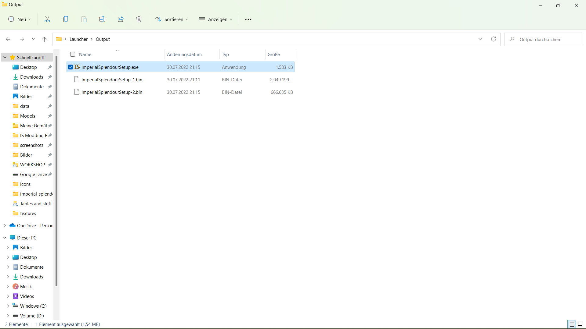
3. Click twice on the 'ImperialSplendourSetup.exe' and allow it to be executed.
4. Now click on 'Next' after you've checked that any other mods (including previous versions of this mod) are disabled or uninstalled (if you use the old launcher, uninstall through the launcher!).

   
5. The installer now searches for the standard path to your Empire Total War installation. If you've installed Empire Total War on a custom path like me, the following window pops up.

   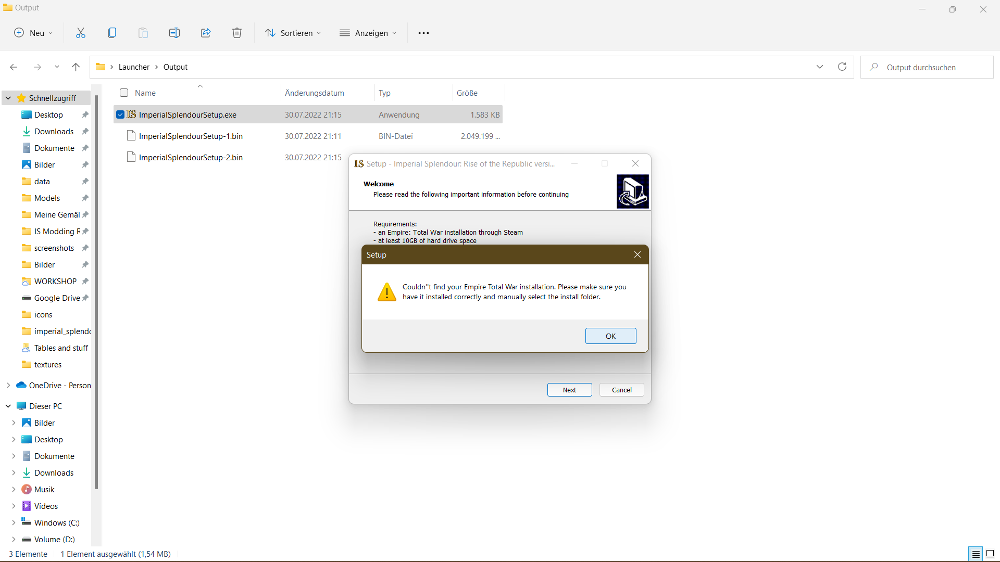
6. If that happens, tell the installer where you've installed Empire Total War by clicking on 'Browse' and then select your 'Empire Total War' folder, 'OK' and 'Next'.

   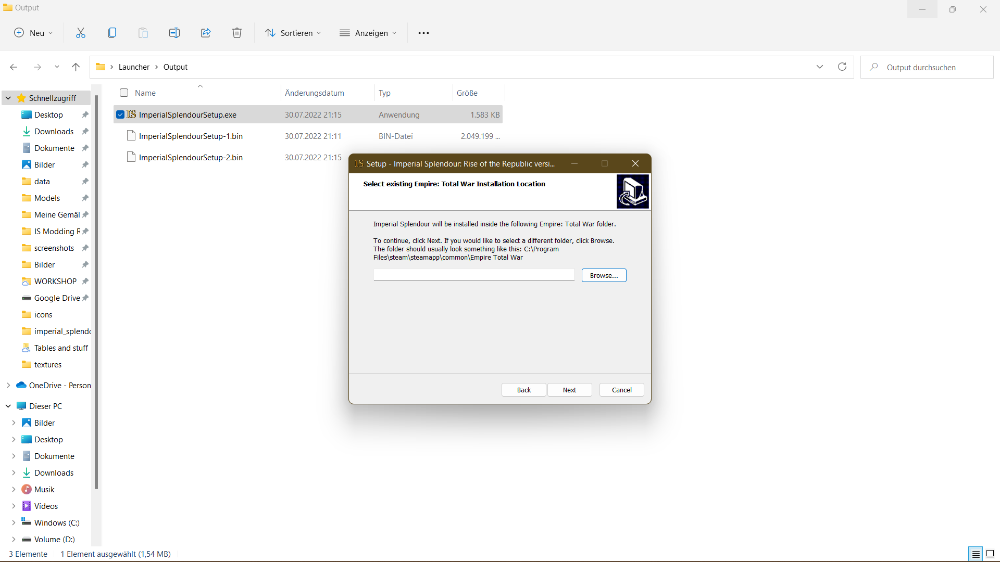

   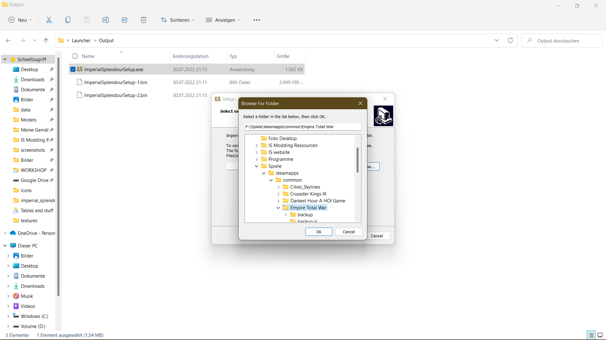

   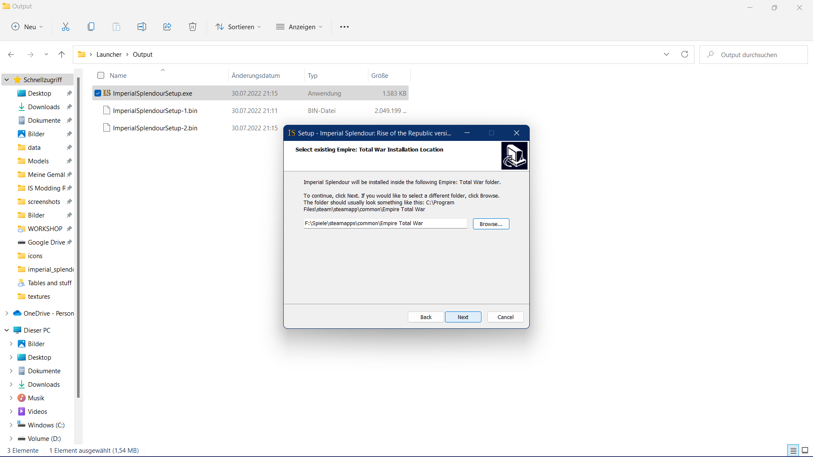
7. If you want, you can now select a different for the Start Menu folder, if you don't, click on 'Next'.

   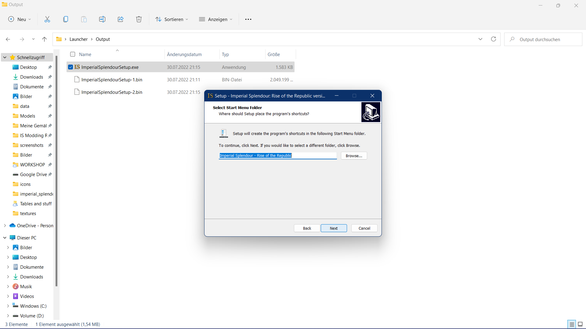
8. You can now choose if you want a desktop shortcut. When you have decided, click on 'Next'.

   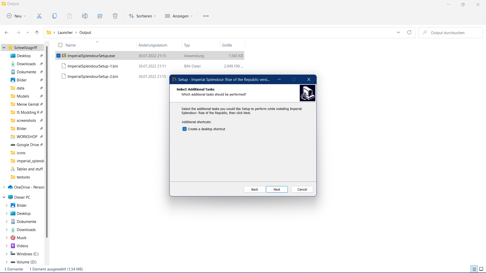
9. Now check if your settings for the installation are as you wish. If yes, click on 'Install' otherwise change your settings.

   
10. Wait until RotR 1.2 is installed. It takes a while, depending on your rig.

    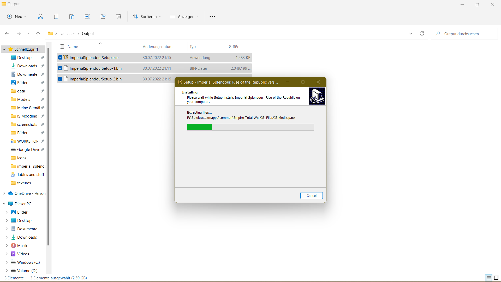
11. Congrats, you now have installed RotR 1.2. You can choose to play directly by clicking on 'Finish'. Allow the following file to be executed.

    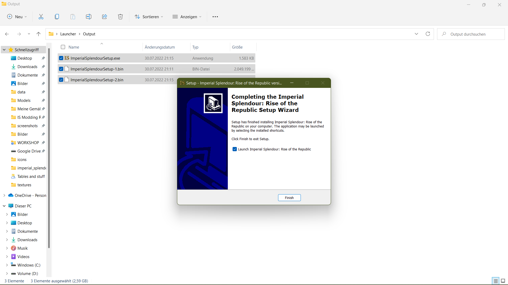
12. Now the Imperial Splendour launcher opens. You can choose to play vanilla Empire Total War or Rise of the Republic 1.2. Click on 'Switch' to play RotR 1.2. As you can see, the RotR header now appears. If you can see the header you can play RotR 1.2 by clicking on 'Play RotR'.

    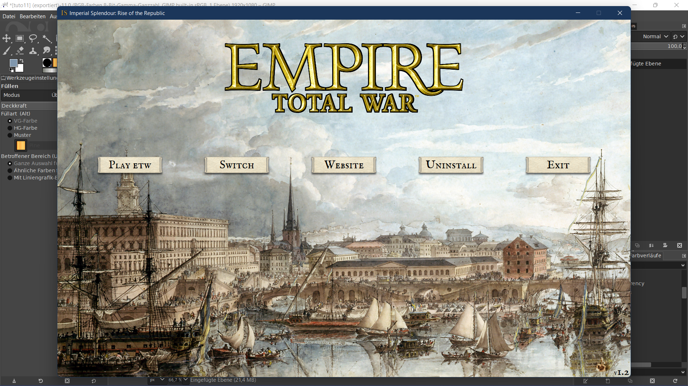

    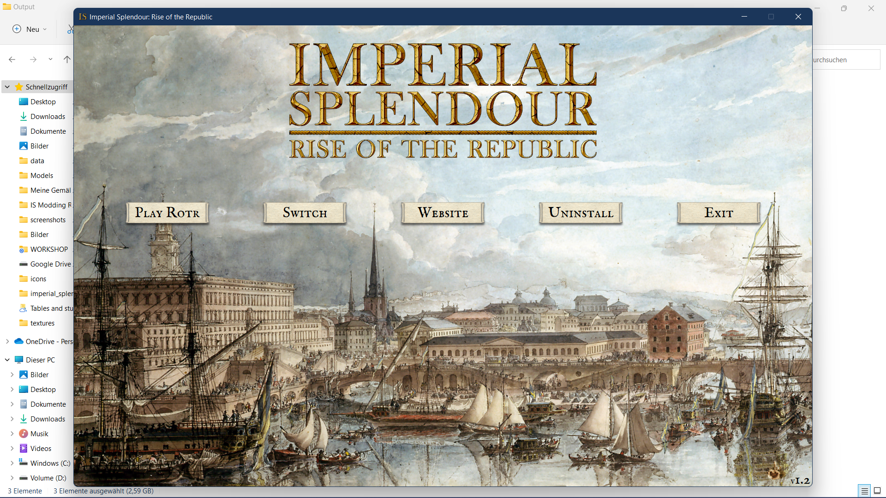
13. If you want to uninstall RotR 1.2 switch back to Empire Total War in the launcher. **If you do not, RotR won't be uninstalled fully!**

    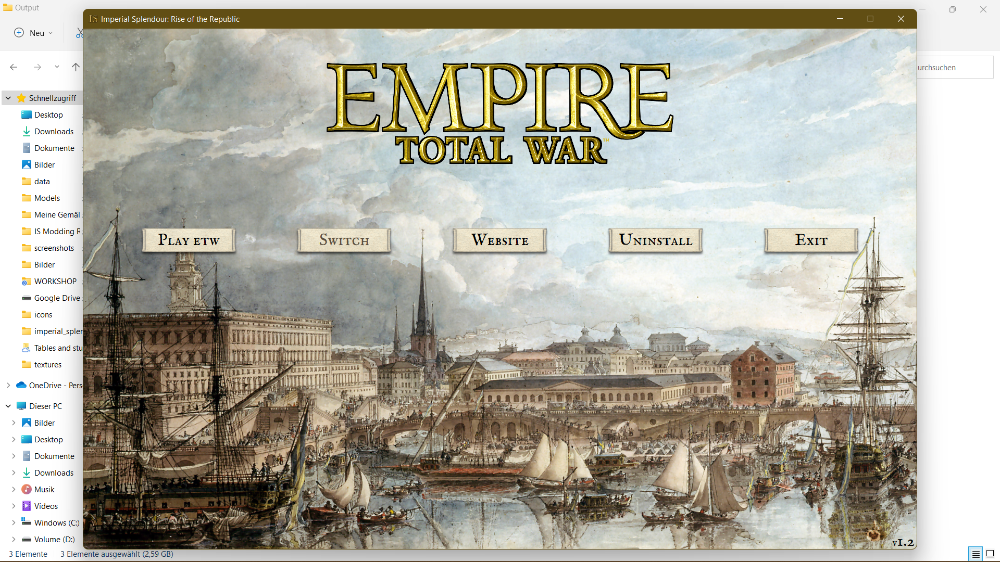
14. Confirm that you want to uninstall RotR 1.2

    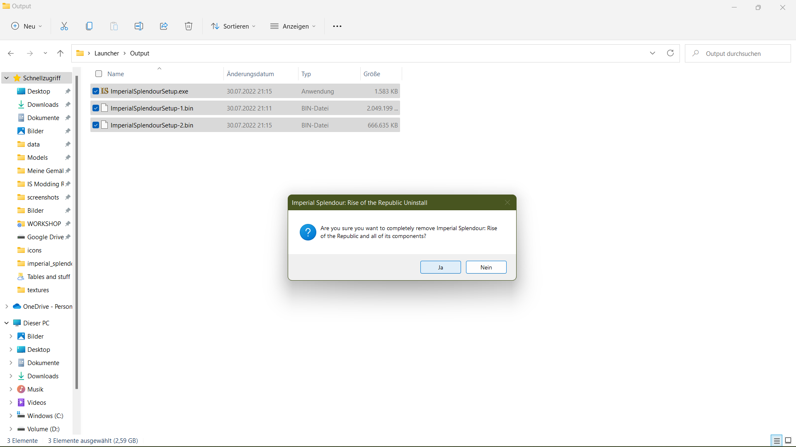
15. Now the following message pops up. You can ignore it when you uninstalled after you've switched to Empire Total War. 

    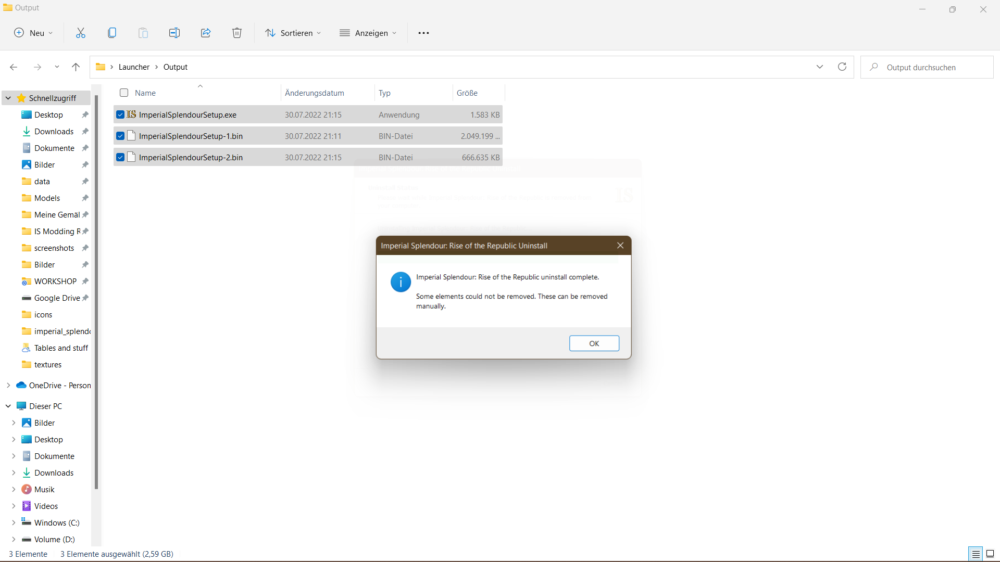

## If you want to install RotR 1.2 manually:

1. Download the manual install (you need to have [7zip](https://www.7-zip.org/) installed).

2. Open the '.7z' file and extract the 'data'-folder into your 'Empire Total War' folder (for the path take a look at No. 6 above).

3. Move the "`user.empire_script.txt`" file to the following folder: `C:\documents and setting\Users\<yourname>\AppData\Roaming\The Creative Assembly\Empire\script`. If you can't find the folder, it's in a hidden folder. You have to enable "show hidden folders" in your OS.