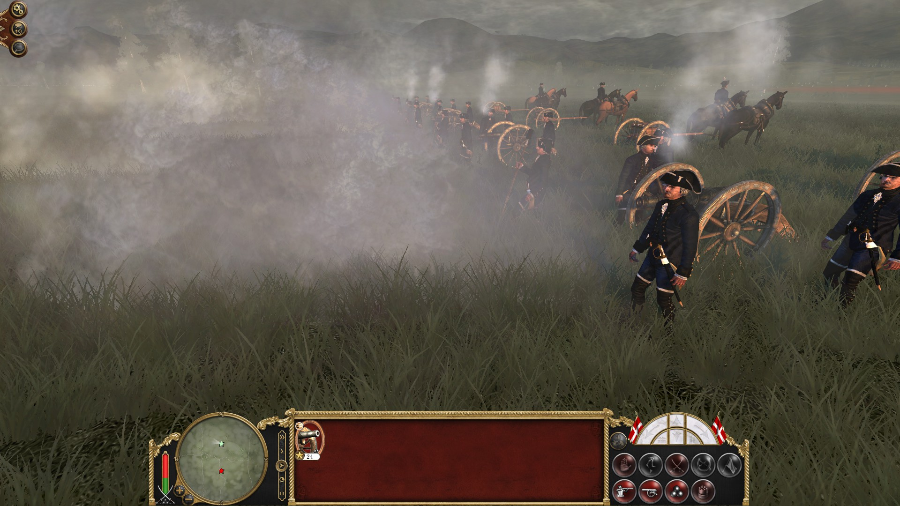
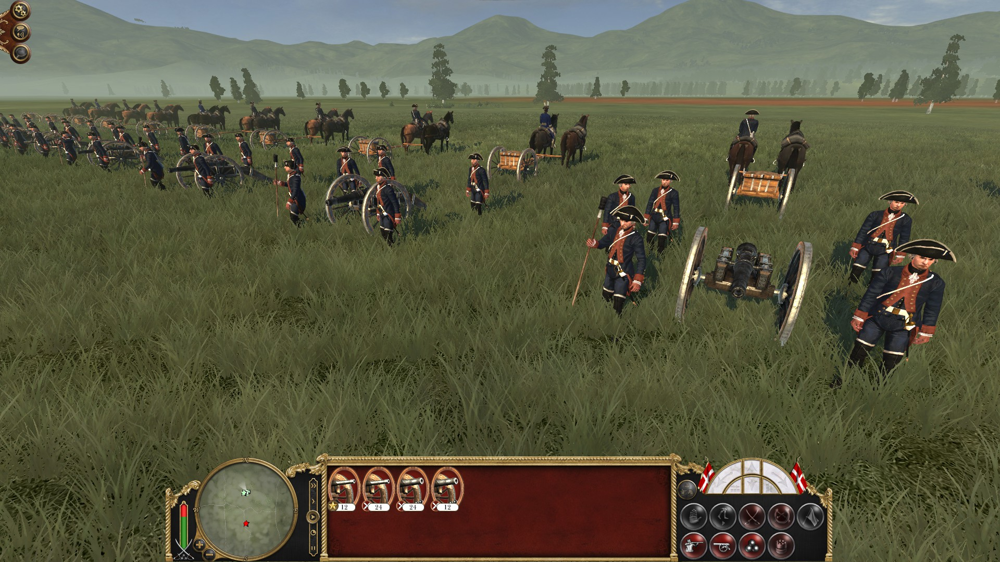
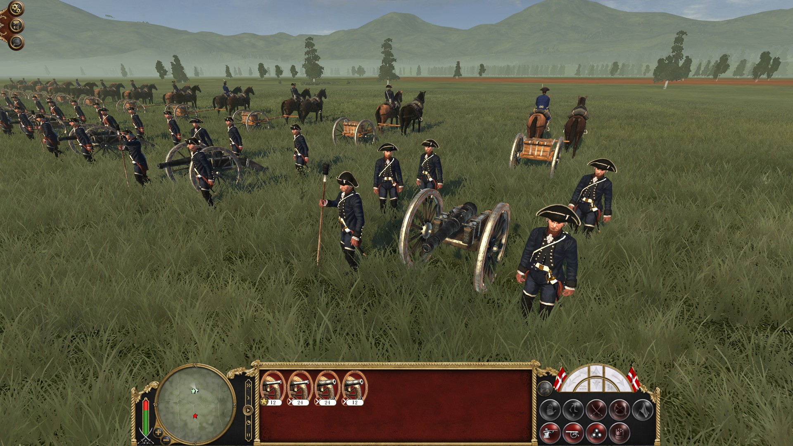

As you may have noticed, last weekend we didn't publish any news. We didn't stop modding, we just decided, that this blog post would be better to present our most recent progress.

##### At first, the final Savoyard units are done, the royal and regimental artillery crews:

##### Here are some close-ups of some units:

Kingdom of Sardinia - Guard Grenadier:

 

Kingdom of Sardinia - Guard Fusilier:

Kingdom of Sardinia - Marine Fusilier:

Kingdom of Sardinia - Line Infantry Fusiliers:

Knights of Saint John - Line Infantry Grenadier:

Knights of Saint John - Line Infantry Fusilier:

Duchy of Tuscany - Cavallegeri (Medium Cavalry):

Duchy of Tuscany - Guard Infantry:

Hannover will get a new custom drum and a buglehorn for the light infantry. The Brunswick units will also get a new drum. Furthermore, we added a lot of new sounds created by Tonnes from the ETW II - team. Listen to the new drumrolls and bugle calls with the new drum and the buglehorn in the videos below:

<iframe width="560" height="315" src="https://www.youtube-nocookie.com/embed/XGAssGV70KA?si=haFzKoQ70CHaN3el" title="YouTube video player" frameborder="0" allow="accelerometer; autoplay; clipboard-write; encrypted-media; gyroscope; picture-in-picture" allowfullscreen>

<iframe width="560" height="315" src="https://www.youtube-nocookie.com/embed/TEYM187ApBU?si=3Zu6qCLI-jxcrDsE" title="YouTube video player" frameborder="0" allow="accelerometer; autoplay; clipboard-write; encrypted-media; gyroscope; picture-in-picture" allowfullscreen>

<iframe width="560" height="315" src="https://www.youtube-nocookie.com/embed/rHQZyq0DYEs?si=uOzWfpmiNrvbaR0t" title="YouTube video player" frameborder="0" allow="accelerometer; autoplay; clipboard-write; encrypted-media; gyroscope; picture-in-picture" allowfullscreen>