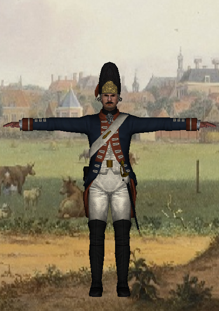
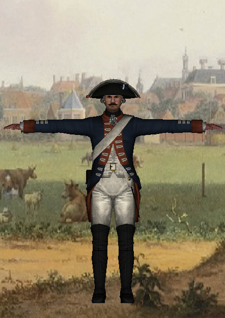
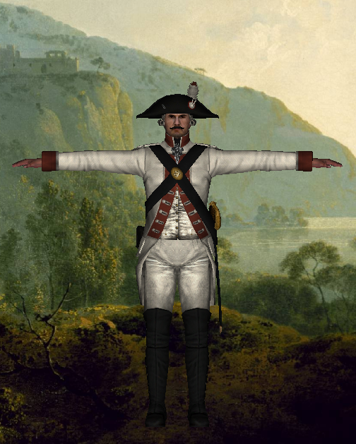
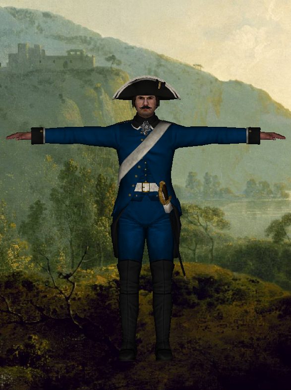

As you may have noticed, last weekend we didn't publish any news. We didn't stop modding, we just decided, that this blog post would be better to present our most recent progress.

#### At first, the final Savoyard units are done, the royal and regimental artillery crews:

#### Here are close-ups of some units from the Kingdom of Sardinia, the Knights of Saint John and the Duchy of Tuscany:

Kingdom of Sardinia - Guard Grenadier and Fusilier:

Kingdom of Sardinia - Marine and Line Infantry Fusiliers:

Knights of Saint John - Line Infantry Grenadier and Fusilier:

Duchy of Tuscany - Guardia Nobile a Cavallo, Cavalleggeri (Medium Cavalry), Guardia a Piedi di Toscana and Artiglieria Toscana:

 

 

")

#### New music (and instruments):

Hannover will get a new custom drum and a buglehorn for the light infantry. The Brunswick units will also get a new drum. Furthermore, we added a lot of new sounds created by Tonnes from the ETW II - team. Listen to the new drumrolls and bugle calls with the new drum and the buglehorn in the videos below:

<iframe width="560" height="315" src="https://www.youtube-nocookie.com/embed/rHQZyq0DYEs?si=brM2c1ArVtk3bX5x" title="YouTube video player" frameborder="0" allow="accelerometer; autoplay; clipboard-write; encrypted-media; gyroscope; picture-in-picture; web-share" referrerpolicy="strict-origin-when-cross-origin" allowfullscreen>

</iframe>

<iframe width="560" height="315" src="https://www.youtube-nocookie.com/embed/XGAssGV70KA?si=E8VGXBOyIpRyvNYt" title="YouTube video player" frameborder="0" allow="accelerometer; autoplay; clipboard-write; encrypted-media; gyroscope; picture-in-picture; web-share" referrerpolicy="strict-origin-when-cross-origin" allowfullscreen>

</iframe>

<iframe width="560" height="315" src="https://www.youtube-nocookie.com/embed/TEYM187ApBU?si=d7weS8-YcGVlsyk5" title="YouTube video player" frameborder="0" allow="accelerometer; autoplay; clipboard-write; encrypted-media; gyroscope; picture-in-picture; web-share" referrerpolicy="strict-origin-when-cross-origin" allowfullscreen>

</iframe>

You can take a closer look at the new Hanoverian bulgehorn on sketchfab too:

    <iframe title="Hanoverian buglehorn" width="640" height="480" src="https://sketchfab.com/models/d4ee27d055414ccb8e87db2cbb433c58/embed" frameborder="0" allow="autoplay; fullscreen; vr" mozallowfullscreen="true" webkitallowfullscreen="true"></iframe>

[Hanoverian buglehorn](https://sketchfab.com/3d-models/hanoverian-buglehorn-d4ee27d055414ccb8e87db2cbb433c58) by [QuintusHortensiusHortalus](https://sketchfab.com/QuintusHortensiusHortalus) on [Sketchfab](https://sketchfab.com)

Furthermore, we work on the UI too. RotR will get a new main menu background. Also, the battle selection screen got an update:

And the flag of the United Provinces is now the [Statenvlag](https://en.wikipedia.org/wiki/Statenvlag):

#### In our next blog, we'll present you the current state of Poland!

