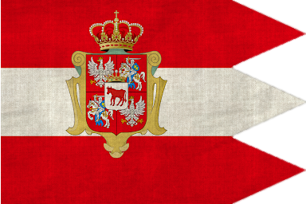

The indecisiveness of king Stanisław Augustus Poniatowski and the paralysis of the Commonwealth have furthered the internal crisis and the future is not very optimistic. Russia is now stronger than ever before so you may want to reconsider declaring war. Your vassal, the Duchy of Courland, is nothing more than a dead letter and is inclined to follow Catherine II's instructions.

The anti-Polish views and hatred towards the Polish people will die with Frederick II, and the future king of Prussia has quite different views and an aggressive anti-Russian attitude. If you were to somehow prevent the "alliance of the three black eagles" from happening, Poland would surely buy more time to manoeuvre its way to the courts of Europe and plead for assistance. Prussia has already drifted away from Russia and allying with them might be a start. Hostilities between the Kingdom of Prussia and the Habsburg Empire are high and an escalation of war is still a possibility. The Ottoman Empire is certain to wage war against Russia and will ally itself with Russia's natural enemy, Sweden. Good relations with the Sultan and Gustav III could be useful.

Try consolidating your ties with Great Britain, but remember it is not the king who declares war, but rather the parliament and the British are not willing to enter war with depleted funds for some distant eastern state. There is always the option to ally yourself with Russia and hope for protection, however, this would cause serious imbalance and Poland may find itself torn between the west and east and its territories turned into battlefields.

The Commonwealth will either face complete annihilation or freedom for its people. One wrong move and the partition might start sooner than expected. The last partition cost you one-third of your land mass and cut off your foreign trade. It will not be easy doing anything without Russia noticing. Act swiftly and you just might survive.