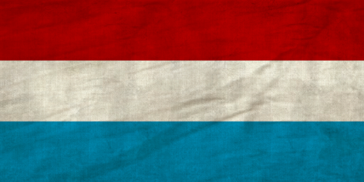
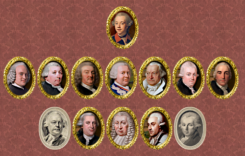

The Fourth Anglo-Dutch War and the political & military indecisiveness of stadtholder William V have become grounds for a looming civil war in the Netherlands. 

Ever since the Glorious Revolution of 1688 the House of Orange has shown its true colours of wanting dynastic and hereditary rule over the United Provinces. With William V's Anglophile views and his wish to centralize the political power his father was granted during the War of Austrian Succession, the stadtholderate is slowly turning into a monarchical pawn for the great powers surrounding us. 

Our embarrassing military display against the British on the African and American continent and likewise the Indian subcontinent uncovered the gross negligence, corruption and ineffectiveness in our empire. Spending has been going into the wrong pockets and the utter disrepair of our naval forces following the sham victory at Doggersbank has shown that although the Staatse Vloot is still a force to be reckoned with, it is a shadow of its former self. 

Our supposed ''alliance'' made with France during the American debacle has shown us that we cannot stand on our own two feet without the assistance of foreign nations. The Brest Affair has shown our military indecisiveness in the face of foreign allies and has been grounds for our international isolation following the Paris Peace Treaty. With Britain gaining free trade passage in the East Indies we have lost our overseas monopoly in the Spice Islands but warm relations with the new parliament in Britain have allied with them a possibility. William V's marriage to Wilhelmina of Prussia made way for good relations with the Prussian Kingdom and secured our German holdings in the Holy Roman Empire. The Austrians however, smell our weakness ever since we entered the war with Britain. They're looming on our doorstep ever since they nullified the Barrier Treaty in 1781, now moving to open the Schelde with force if necessary. 

So, after our position in America and Asia being returned to a form of stability with the French handing us our crucial colonies back our European position remains uncertain. Patriotic Excercitiegenootschappen (Civil Militias) are being formed and are roaming the countryside in defiance of the undemocratic antics of the stadtholderate and are becoming a thorn in our side. As the country steers further into instability the future lies in your hands to decide to continue the status quo or defy either the general populace or the stadtholderate institution. 

Act decisively, before we turn into a mere pawn in a chess game.

### **And here is your army which might prevent you from getting a pawn in the game for European supremacy:**

Dragoon of the "Garde Dragonders" and Officer of the "Hollandse Garde": 

 

Officer of the "Hollandse Cavalerie":

Fusilier of the Swiss Infantry and Grenadier of the "Waldeck" foreign Infantry: 

 

Grenadier of the "Exercitiegenootschappen" patriotic militia, notable for their role in the 1787 Patriottentijd "rebellion" and Fusilier of the "Schutterij" militia, the old (Orangist) militia of the Netherlands: 

 

Dragoon of the "Javaanse Dragonders", Javanese Dragoons in service of the VOC and French Regiment de Meuron (1795), in service with the VOC: 

 

### **Here are the men who lead your government:**

#### Stadhouder: [Willem V](https://en.wikipedia.org/wiki/William_V,_Prince_of_Orange)

#### Staten-Generaal:

1. Raadpensionaris: [Pieter van Bleiswijk](https://en.wikipedia.org/wiki/Pieter_van_Bleiswijk)
2. Thesaurier Generaal: [Dirk Rudolf Wijckerheld Bisdom](https://nl.wikipedia.org/wiki/Bisdom_(geslacht))
3. Hoofdschout: [Abraham Calkoen](https://nl.wikipedia.org/wiki/Abraham_Calkoen)
4. Kapitein Generaal: [Lodewijk Ernst van Brunswijk-Wolfenbüttel](https://en.wikipedia.org/wiki/Duke_Louis_Ernest_of_Brunswick-L%C3%BCneburg)
5. Advocaat Fiscaal: [Joan Cornelis van der Hoop](https://en.wikipedia.org/wiki/Joan_Cornelis_van_der_Hoop)
6. Bewindhebber van de W.I.C.: [Jan Bernd Bicker](https://en.wikipedia.org/wiki/Jan_Bernd_Bicker)
7. Gouverneur Generaal: [Willem Arnold Alting](https://en.wikipedia.org/wiki/Willem_Arnold_Alting)

#### Opposition:

1. [Engelbert François van Berckel](https://en.wikipedia.org/wiki/Engelbert_Fran%C3%A7ois_van_Berckel)
2. [Carel Wouter Visscher](https://nl.wikipedia.org/wiki/Carel_Wouter_Visscher)
3. Hendrik Daniёlszoon Hooft
4. [Adriaan van Zeebergh](https://nl.wikipedia.org/wiki/Adriaan_van_Zeebergh)
5. [Pieter Paulus](https://nl.wikipedia.org/wiki/Pieter_Paulus)

Also, we added updated flags for the campaign and battles. Have a look at how the colonel's colours for the United Provinces were created:

<iframe width="560" height="315" src="https://www.youtube-nocookie.com/embed/vCs8quP1AFk?si=_6iB37TuvPMhXp3F" title="YouTube video player" frameborder="0" allow="accelerometer; autoplay; clipboard-write; encrypted-media; gyroscope; picture-in-picture" allowfullscreen>

#### Our next developer's blog will feature the final part of the Neapolitan army.

