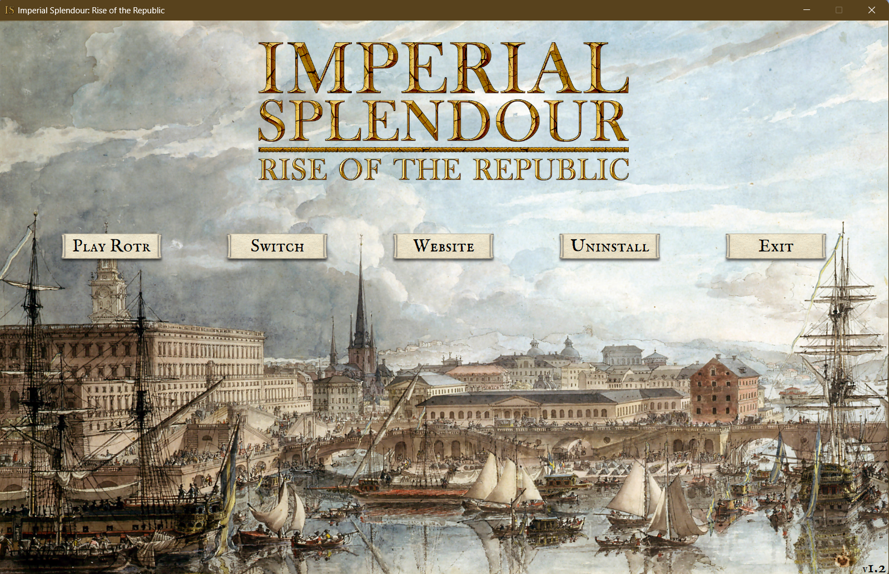
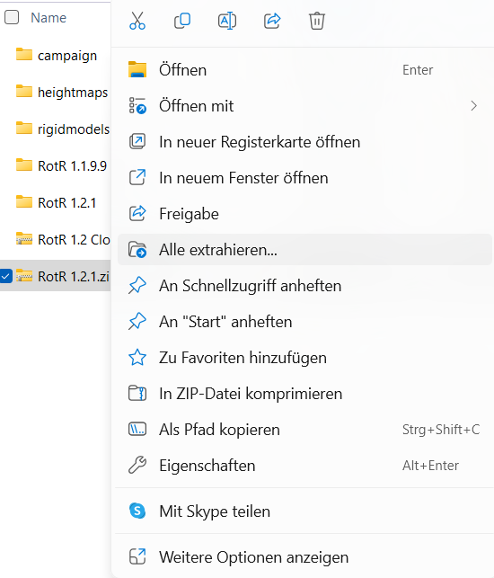
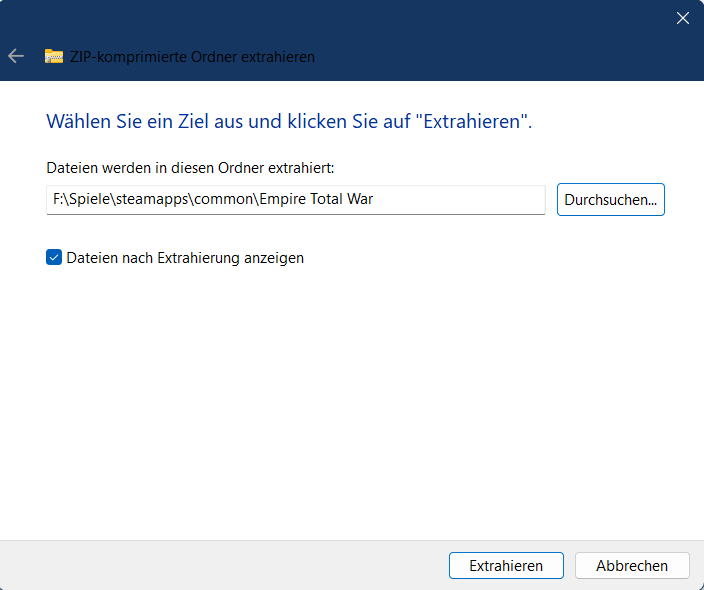
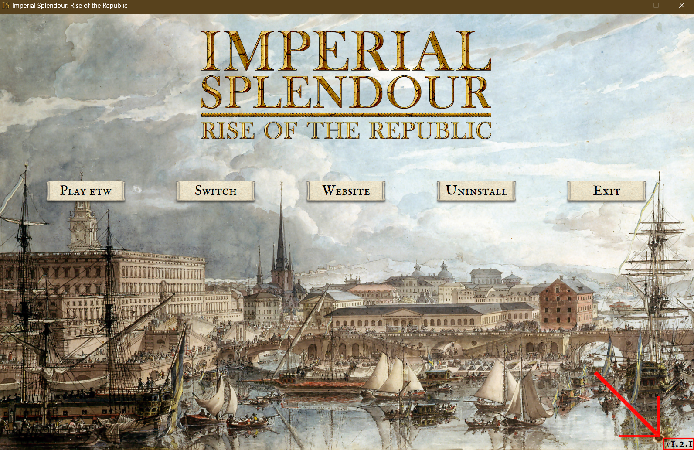

### Greetings everyone!

There was no preview this week because we prepared a bugfix patch for you! Our beta testing is running well and we already have some results. Most important we could identify the source of random campaign crashes.

So with the Patch, the random campaign crashes will be fixed. Also, some time ago we noticed a critical error in the naval script that disables and then re-enables the late ships throughout the campaign. We corrected this issue some time ago unofficially with a hotfix available on our Discord server, and after some testing now it's here.

This script will disable the "late ships" of your faction on turn 2 (please always pass the first turn with no interactions!) and will re-enable them on the late part of your campaign, around the year 1793. We've moved the date up a bit as we've heard several reports on the time not being enough to fully exploit the early ships, and, with several building upgrades and technologies required too, we understand this. So at turn 50 you should lose your old early ships and gain new, late ones.

Please remember that the change does not suit every faction the same and, for a few factions, it hinders your navy's size and capabilities (as historically depicted). We encourage you to try every nation out and see what fits your game style the best! And if that certain faction you love happens to lose naval capabilities at the end-game, remember that all factions have a unique technology providing with very-late, very-powerful ships, some, in the case of Sweden for example, never placed under construction but which plans remain to this day. Use them wisely.

### [Download RotR 1.2.1 here](https://imperialsplendour.com/download) (at the bottom of the page).

#### Here is the installation tutorial:

1. If you haven't installed RotR 1.2 yet, [download RotR 1.2](https://imperialsplendour.com/download) and [install it](https://imperialsplendour.com/blog/2022-08-01-rotr-12-installation-tutorial). 
2. [Download RotR 1.2.1](https://imperialsplendour.com/download). You can find download links at the bottom of the side.
3. (**Only if you use the launcher**: Make sure you activated RotR 1.2 through the launcher, that is the case when you can see the RotR logo. Then close the launcher.)

   
4. Click right on the RotR 1.2.1.zip file and left on Extract All..

   
5. Select your Empire Total War folder as the path. The path should have the following ending: ...\steamapps\common\Empire Total War.

   
6. Click on extract and confirm you want to overwrite files.
7. (**Only if you use the launcher**: Start the launcher again, if you can see the version number "1.2.1" in the bottom right corner you have successfully installed RotR 1.2.1.)

   
8. You got it, you now have installed RotR 1.2.1.

#### Changelog:

1. Removed:
   export_triggers.lua because it caused random CTDs during a campaign.
2. Fixed:\
   The scripting.lua disabling late-era ships.