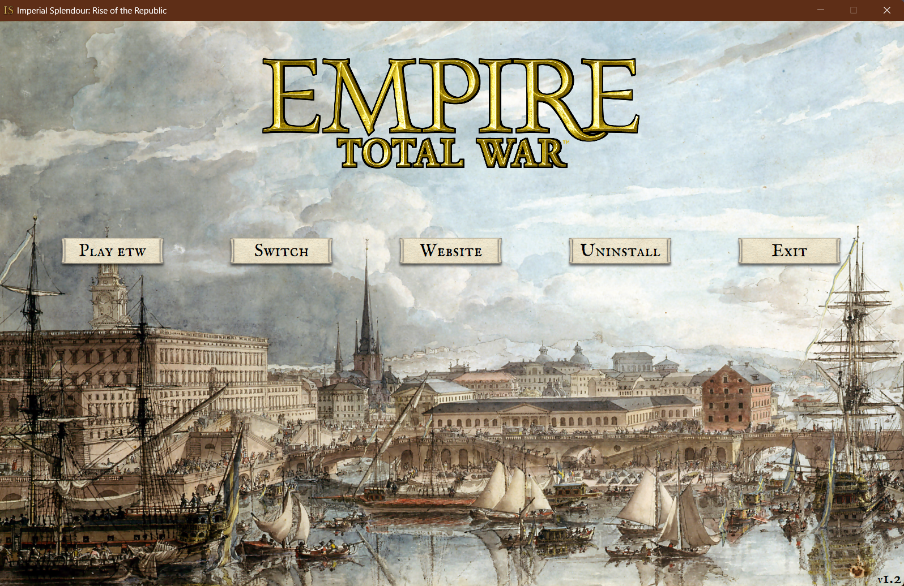

### Greetings everyone!

There was no preview this week because we prepared a bugfix patch for you! Our beta testing is running well and we already have some results. Most important we could identify the source of random campaign crashes.

#### Here is the installation tutorial:

1. If you haven't installed RotR 1.2 yet, [download RotR 1.2](https://imperialsplendour.com/download) and [install it](https://imperialsplendour.com/blog/2022-08-01-rotr-12-installation-tutorial). 
2. Download RotR 1.2.1
3. Open the .zip file.

   \[img]
4. There are two folders in the .zip file. If you use the **launcher proceed with step *5*** if you have installed RotR 1.2 **manually proceed with step X**.
5. Open the launcher.

   

6. Deactivate RotR.

   
7.