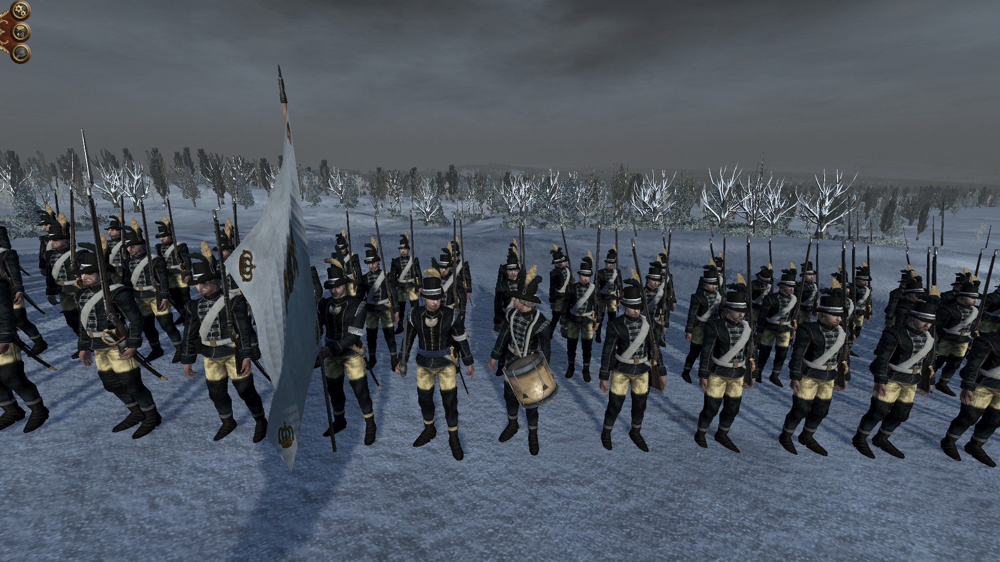

Here is the preview of our newest update, 1.1.9, Patch 2. This is an open Beta and not heavily tested but should fix the annoying campaign bug from 1.1.

We now have a new tag, created by oleg2242

Furthermore the flag set has been replaced by wangrin's and Herr Doktor's work (and a bit of mine) and there are many new historical characters in the game for you to find and defeat ;)

In addition Hannover got a new UI in the Neoclassical style

At last Sweden is partly reworked

## Swedish Army

### 1. General

### 2. Infantry

#### Guards

##### Officer

##### Foot Guards

##### King's mother guards
  

#### Line infantry

##### King's own regiment

##### Infantry regiment

#### Garnisonsregemente

#### Light infantry

##### Värmlands Fältjägarkår and Karelska Jägarkåren

##### Light infantery battalion

##### Savolax jägarregemente kompani

### 3. Cavalry

#### Line Cavalry

##### Lif Drabant Corps

##### Lif Regemente

##### Lif Dragonerne

##### Cavallerie Regemente

##### Dragoons

#### Light Cavalry

##### Husars

##### Jämtlands hästjägarkompani mounted

and fighting dismouted

##### Lätta dragonkåren

### 4. Artillery

### 5. Navy

#### Naval Officers

#### Marines

## New Government

Kung: Gustav III

##### Government (from left to right)

1. Kanslipresident: Ulric Scheffer
2. President i Statskontoret: Johan Liljencrantz
3. Justitiekanslern: Carl Axel Wachtmeister
4. Statssekreterare vid Krigsexpeditionen: Johan Gustav von Carlsson
5. Överamiral vid örlogsflottan: Henrik af Trolle

##### Candidates

1. Gustav Philip Creutz
2. Eric Ruuth
3. Carl August Ehrensvärd
4. Johan Gabriel Oxenstierna
5. Carl Lagerbring

Research done by CroHunger999

## [Download Patch 2 - Open Beta](https://www.moddb.com/mods/imperial-splendour/downloads/rotr-119-patch-2-open-beta)